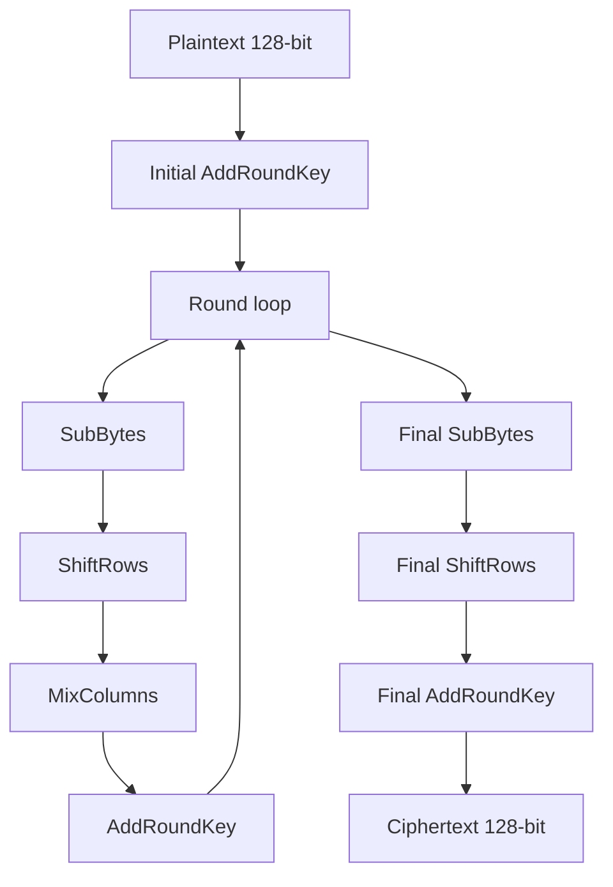
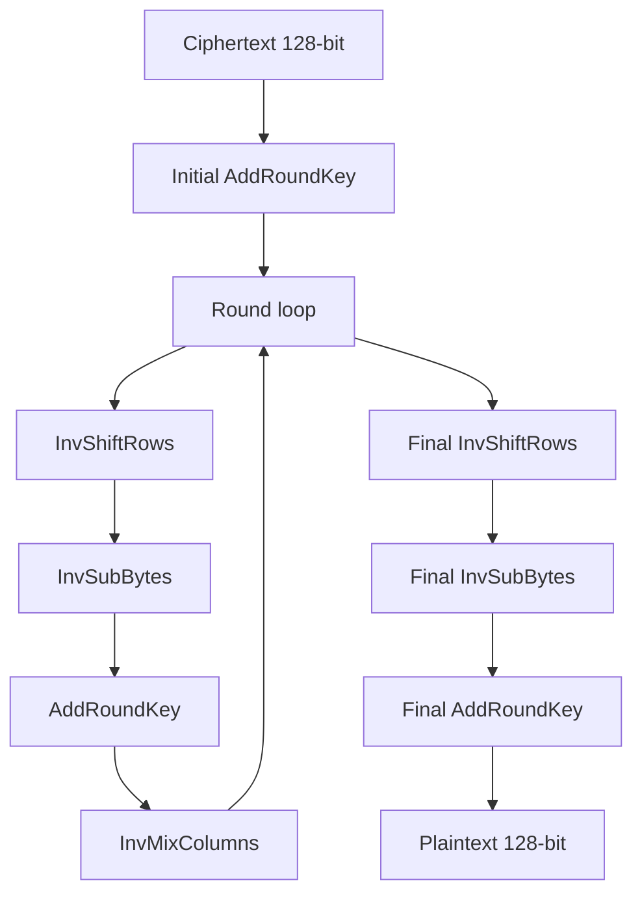
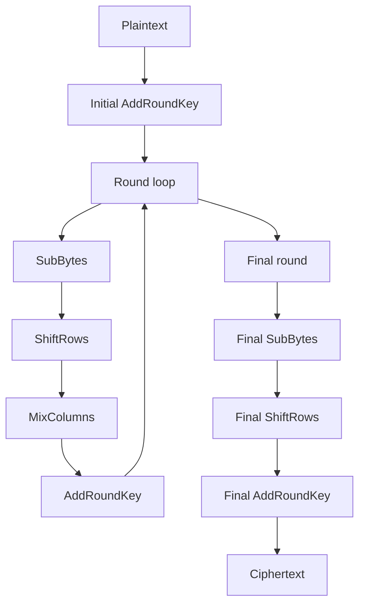
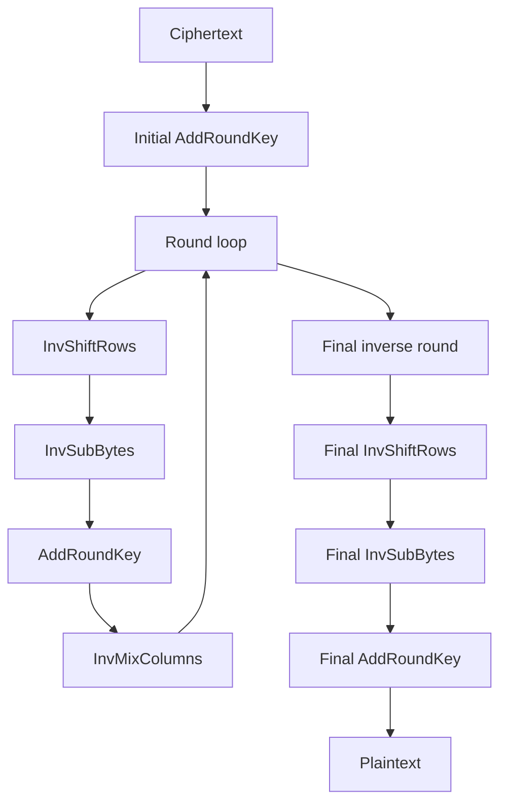
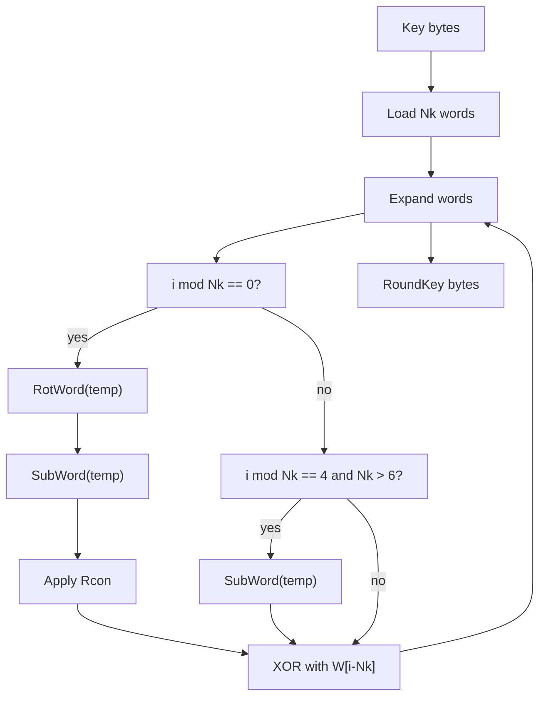
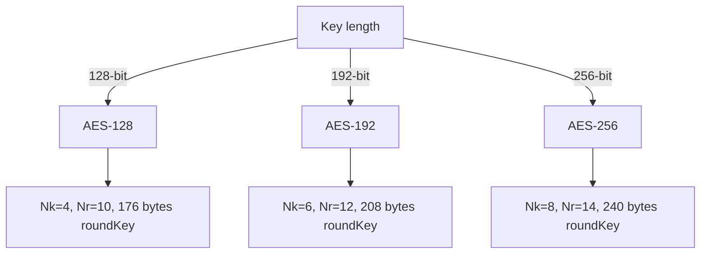

# AES 算法详解

## 文档状态

已补全 AES 算法核心原理、运算流程、密钥扩展、C 语言实现框架、以及 OpenSSL/GMSSL 使用示例。

## 目录

1. 算法背景
2. 参数与记号
3. 数学基础
4. AES 核心变换
5. 密钥扩展 (Key Schedule)
6. AES 加密流程
7. AES 解密流程
8. Mermaid 流程图
9. 数据结构设计
10. C 语言实现框架
11. AES-192 / AES-256 扩展说明
12. 常见分组模式与填充
13. OpenSSL / GMSSL 使用
14. 测试向量与验证
15. 安全性分析
16. 工程建议

## 1. 算法背景

AES（Advanced Encryption Standard，高级加密标准）由 Joan Daemen 和 Vincent Rijmen 设计，标准名为 Rijndael。
2001 年被 NIST 采纳为联邦信息处理标准 FIPS-197。

AES 采用分组密码结构，对固定 128 位分组进行加密，支持 128、192、256 位密钥长度。

- AES-128: 10 轮
- AES-192: 12 轮
- AES-256: 14 轮

## 2. 参数与记号

- 明文块 `P`：128 位，按列填充到 `4 x 4` 的状态矩阵 `State`。
- 密钥 `K`：`Nk x 32` 位，其中 `Nk=4,6,8` 对应 AES-128/192/256。
- 轮密钥 `RoundKey[i]`：每轮 128 位。
- 轮数 `Nr`：`Nk + 6`。

状态矩阵 `State` 表示为：

```
State = [s_0,0 s_0,1 s_0,2 s_0,3
         s_1,0 s_1,1 s_1,2 s_1,3
         s_2,0 s_2,1 s_2,2 s_2,3
         s_3,0 s_3,1 s_3,2 s_3,3]
```

其中每个字节 `s_r,c` 在 GF(2^8) 中运算。

## 3. 数学基础

AES 的核心运算基于有限域 GF(2^8)，使用不可约多项式

```
x^8 + x^4 + x^3 + x + 1
```

字节乘法定义为多项式乘法对该不可约多项式取模。

### 3.1 S-Box

AES 使用固定 8x8 S-Box 作为非线性替代，以抵抗线性和差分密码分析。

S-Box 的构造步骤：

1. 将输入字节视为 GF(2^8) 中的多项式 `a(x)`。
2. 求其在 GF(2^8) 下的乘法逆元 `a^{-1}(x)`，对 `0x00` 定义为自身。
3. 对结果字节 `b` 做仿射变换：

   ```
   b' = M * b ^ c
   ```

   其中 `M` 是固定 8x8 二进制矩阵，`c = 0x63`。

S-Box 的具体映射如下（前 16 个值示例）：

```
0x00 -> 0x63, 0x01 -> 0x7C, 0x02 -> 0x77, 0x03 -> 0x7B
0x04 -> 0xF2, 0x05 -> 0x6B, 0x06 -> 0x6F, 0x07 -> 0xC5
...
```

逆 S-Box 运算是其逆映射，用于解密过程。

### 3.2 MixColumns

MixColumns 将 `State` 中每列视为多项式

```
a(x) = a_0 + a_1 x + a_2 x^2 + a_3 x^3
```

在 GF(2^8) 中与固定多项式

```
c(x) = 03 x^3 + 01 x^2 + 01 x + 02
```

相乘，并对 `x^4 + 1` 取模。

矩阵形式：

```
[02 03 01 01]
[01 02 03 01]
[01 01 02 03]
[03 01 01 02]
```

其中乘法 `2*a` 等价于 GF(2^8) 中的左移并对多项式 `0x1B` 取模：

```
xtime(a) = (a << 1) ^ ((a & 0x80) ? 0x1B : 0x00)
```

乘法 `3*a` 则可表示为 `xtime(a) ^ a`。

对应运算为：

```
c_0 = 2*a_0 ^ 3*a_1 ^ a_2 ^ a_3
c_1 = a_0 ^ 2*a_1 ^ 3*a_2 ^ a_3
c_2 = a_0 ^ a_1 ^ 2*a_2 ^ 3*a_3
c_3 = 3*a_0 ^ a_1 ^ a_2 ^ 2*a_3
```

## 4. AES 核心变换

每轮加密包含四个子变换：

1. SubBytes: 对 `State` 中每个字节应用 S-Box。
2. ShiftRows: 第 `r` 行循环左移 `r` 个字节。
3. MixColumns: 每列做 GF(2^8) 线性变换。
4. AddRoundKey: 与轮密钥逐字节异或。

最后一轮省略 MixColumns。

## 5. 密钥扩展 (Key Schedule)

密钥扩展将 `Nk` 个 32-bit 单元扩展为 `(Nb*(Nr+1))` 个 32-bit 单元，其中 `Nb=4`。

伪码：

```
for i in 0..Nk-1:
    W[i] = K[i]
for i in Nk..Nb*(Nr+1)-1:
    temp = W[i-1]
    if i % Nk == 0:
        temp = SubWord(RotWord(temp)) ^ Rcon[i/Nk]
    else if Nk > 6 and i % Nk == 4:
        temp = SubWord(temp)
    W[i] = W[i-Nk] ^ temp
```

其中：

- `RotWord` 将 32-bit 单元循环左移 8 位。
- `SubWord` 对每个字节执行 S-Box。
- `Rcon[i]` 是仅在最高字节非零的常数数组。

## 6. AES 加密流程

AES-128 加密总流程：

1. 初始化 `State` 为明文块。
2. 初始轮：`AddRoundKey(State, RoundKey[0])`。
3. 对 `round = 1..Nr-1` 执行：
   - `SubBytes`
   - `ShiftRows`
   - `MixColumns`
   - `AddRoundKey`
4. 最后一轮：
   - `SubBytes`
   - `ShiftRows`
   - `AddRoundKey`
5. 输出 `State` 为密文块。

伪码：

```
State = PlainText
AddRoundKey(State, RoundKey[0])
for round in 1..Nr-1:
    SubBytes(State)
    ShiftRows(State)
    MixColumns(State)
    AddRoundKey(State, RoundKey[round])
SubBytes(State)
ShiftRows(State)
AddRoundKey(State, RoundKey[Nr])
CipherText = State
```

### 6.1 AES 加密流程图



## 7. AES 解密流程

解密利用逆变换：

- InvShiftRows
- InvSubBytes
- AddRoundKey
- InvMixColumns

解密轮次从 `RoundKey[Nr]` 开始反向执行。

伪码：

```
State = CipherText
AddRoundKey(State, RoundKey[Nr])
for round in Nr-1..1:
    InvShiftRows(State)
    InvSubBytes(State)
    AddRoundKey(State, RoundKey[round])
    InvMixColumns(State)
InvShiftRows(State)
InvSubBytes(State)
AddRoundKey(State, RoundKey[0])
PlainText = State
```

### 7.1 AES 解密流程图



## 8. Mermaid 流程图

### 8.1 AES 加密流程



### 8.2 AES 解密流程



### 8.3 AES 密钥扩展流程



### 8.4 AES 变种选择



## 9. 数据结构设计

推荐数据结构：

- `uint8_t state[4][4]`
- `uint8_t roundKey[176]` (AES-128)
- `uint8_t key[16]`

接口设计示例：

- `void AES_KeyExpansion(const uint8_t *key, int keyLenBytes, uint8_t *roundKey, int *outNr);`  // keyLenBytes = 16|24|32, roundKey buffer >= 16*(Nr+1)
- `void AES_EncryptBlock(const uint8_t in[16], uint8_t out[16], const uint8_t *roundKey, int Nr);`
- `void AES_DecryptBlock(const uint8_t in[16], uint8_t out[16], const uint8_t *roundKey, int Nr);`

## 10. C 语言实现框架

示例实现包含完整 AES-128 密钥扩展与加解密操作。

```c
#include <stdint.h>
#include <string.h>

typedef uint8_t u8;
typedef uint32_t u32;

static const u8 sbox[256] = {
    0x63,0x7c,0x77,0x7b,0xf2,0x6b,0x6f,0xc5,0x30,0x01,0x67,0x2b,0xfe,0xd7,0xab,0x76,
    0xca,0x82,0xc9,0x7d,0xfa,0x59,0x47,0xf0,0xad,0xd4,0xa2,0xaf,0x9c,0xa4,0x72,0xc0,
    0xb7,0xfd,0x93,0x26,0x36,0x3f,0xf7,0xcc,0x34,0xa5,0xe5,0xf1,0x71,0xd8,0x31,0x15,
    0x04,0xc7,0x23,0xc3,0x18,0x96,0x05,0x9a,0x07,0x12,0x80,0xe2,0xeb,0x27,0xb2,0x75,
    0x09,0x83,0x2c,0x1a,0x1b,0x6e,0x5a,0xa0,0x52,0x3b,0xd6,0xb3,0x29,0xe3,0x2f,0x84,
    0x53,0xd1,0x00,0xed,0x20,0xfc,0xb1,0x5b,0x6a,0xcb,0xbe,0x39,0x4a,0x4c,0x58,0xcf,
    0xd0,0xef,0xaa,0xfb,0x43,0x4d,0x33,0x85,0x45,0xf9,0x02,0x7f,0x50,0x3c,0x9f,0xa8,
    0x51,0xa3,0x40,0x8f,0x92,0x9d,0x38,0xf5,0xbc,0xb6,0xda,0x21,0x10,0xff,0xf3,0xd2,
    0xcd,0x0c,0x13,0xec,0x5f,0x97,0x44,0x17,0xc4,0xa7,0x7e,0x3d,0x64,0x5d,0x19,0x73,
    0x60,0x81,0x4f,0xdc,0x22,0x2a,0x90,0x88,0x46,0xee,0xb8,0x14,0xde,0x5e,0x0b,0xdb,
    0xe0,0x32,0x3a,0x0a,0x49,0x06,0x24,0x5c,0xc2,0xd3,0xac,0x62,0x91,0x95,0xe4,0x79,
    0xe7,0xc8,0x37,0x6d,0x8d,0xd5,0x4e,0xa9,0x6c,0x56,0xf4,0xea,0x65,0x7a,0xae,0x08,
    0xba,0x78,0x25,0x2e,0x1c,0xa6,0xb4,0xc6,0xe8,0xdd,0x74,0x1f,0x4b,0xbd,0x8b,0x8a,
    0x70,0x3e,0xb5,0x66,0x48,0x03,0xf6,0x0e,0x61,0x35,0x57,0xb9,0x86,0xc1,0x1d,0x9e,
    0xe1,0xf8,0x98,0x11,0x69,0xd9,0x8e,0x94,0x9b,0x1e,0x87,0xe9,0xce,0x55,0x28,0xdf,
    0x8c,0xa1,0x89,0x0d,0xbf,0xe6,0x42,0x68,0x41,0x99,0x2d,0x0f,0xb0,0x54,0xbb,0x16
};

static const u8 inv_sbox[256] = {
    0x52,0x09,0x6A,0xD5,0x30,0x36,0xA5,0x38,0xBF,0x40,0xA3,0x9E,0x81,0xF3,0xD7,0xFB,
    0x7C,0xE3,0x39,0x82,0x9B,0x2F,0xFF,0x87,0x34,0x8E,0x43,0x44,0xC4,0xDE,0xE9,0xCB,
    0x54,0x7B,0x94,0x32,0xA6,0xC2,0x23,0x3D,0xEE,0x4C,0x95,0x0B,0x42,0xFA,0xC3,0x4E,
    0x08,0x2E,0xA1,0x66,0x28,0xD9,0x24,0xB2,0x76,0x5B,0xA2,0x49,0x6D,0x8B,0xD1,0x25,
    0x72,0xF8,0xF6,0x64,0x86,0x68,0x98,0x16,0xD4,0xA4,0x5C,0xCC,0x5D,0x65,0xB6,0x92,
    0x6C,0x70,0x48,0x50,0xFD,0xED,0xB9,0xDA,0x5E,0x15,0x46,0x57,0xA7,0x8D,0x9D,0x84,
    0x90,0xD8,0xAB,0x00,0x8C,0xBC,0xD3,0x0A,0xF7,0xE4,0x58,0x05,0xB8,0xB3,0x45,0x06,
    0xD0,0x2C,0x1E,0x8F,0xCA,0x3F,0x0F,0x02,0xC1,0xAF,0xBD,0x03,0x01,0x13,0x8A,0x6B,
    0x3A,0x91,0x11,0x41,0x4F,0x67,0xDC,0xEA,0x97,0xF2,0xCF,0xCE,0xF0,0xB4,0xE6,0x73,
    0x96,0xAC,0x74,0x22,0xE7,0xAD,0x35,0x85,0xE2,0xF9,0x37,0xE8,0x1C,0x75,0xDF,0x6E,
    0x47,0xF1,0x1A,0x71,0x1D,0x29,0xC5,0x89,0x6F,0xB7,0x62,0x0E,0xAA,0x18,0xBE,0x1B,
    0xFC,0x56,0x3E,0x4B,0xC6,0xD2,0x79,0x20,0x9A,0xDB,0xC0,0xFE,0x78,0xCD,0x5A,0xF4,
    0x1F,0xDD,0xA8,0x33,0x88,0x07,0xC7,0x31,0xB1,0x12,0x10,0x59,0x27,0x80,0xEC,0x5F,
    0x60,0x51,0x7F,0xA9,0x19,0xB5,0x4A,0x0D,0x2D,0xE5,0x7A,0x9F,0x93,0xC9,0x9C,0xEF,
    0xA0,0xE0,0x3B,0x4D,0xAE,0x2A,0xF5,0xB0,0xC8,0xEB,0xBB,0x3C,0x83,0x53,0x99,0x61,
    0x17,0x2B,0x04,0x7E,0xBA,0x77,0xD6,0x26,0xE1,0x69,0x14,0x63,0x55,0x21,0x0C,0x7D
};

static const u8 Rcon[11] = {
    0x00, 0x01, 0x02, 0x04, 0x08,
    0x10, 0x20, 0x40, 0x80, 0x1B, 0x36
};

static u8 xtime(u8 x) {
    return (u8)((x << 1) ^ ((x & 0x80) ? 0x1B : 0x00));
}

static u8 mul(u8 a, u8 b) {
    u8 result = 0;
    while (b) {
        if (b & 1) result ^= a;
        a = xtime(a);
        b >>= 1;
    }
    return result;
}

static void SubBytes(u8 state[4][4]) {
    for (int r = 0; r < 4; ++r)
        for (int c = 0; c < 4; ++c)
            state[r][c] = sbox[state[r][c]];
}

static void InvSubBytes(u8 state[4][4]) {
    for (int r = 0; r < 4; ++r)
        for (int c = 0; c < 4; ++c)
            state[r][c] = inv_sbox[state[r][c]];
}

static void ShiftRows(u8 state[4][4]) {
    u8 temp[4];
    for (int r = 1; r < 4; ++r) {
        for (int c = 0; c < 4; ++c)
            temp[c] = state[r][(c + r) % 4];
        for (int c = 0; c < 4; ++c)
            state[r][c] = temp[c];
    }
}

static void InvShiftRows(u8 state[4][4]) {
    u8 temp[4];
    for (int r = 1; r < 4; ++r) {
        for (int c = 0; c < 4; ++c)
            temp[c] = state[r][(c - r + 4) % 4];
        for (int c = 0; c < 4; ++c)
            state[r][c] = temp[c];
    }
}

static void MixColumns(u8 state[4][4]) {
    for (int c = 0; c < 4; ++c) {
        u8 a0 = state[0][c];
        u8 a1 = state[1][c];
        u8 a2 = state[2][c];
        u8 a3 = state[3][c];
        state[0][c] = (u8)(mul(a0, 2) ^ mul(a1, 3) ^ a2 ^ a3);
        state[1][c] = (u8)(a0 ^ mul(a1, 2) ^ mul(a2, 3) ^ a3);
        state[2][c] = (u8)(a0 ^ a1 ^ mul(a2, 2) ^ mul(a3, 3));
        state[3][c] = (u8)(mul(a0, 3) ^ a1 ^ a2 ^ mul(a3, 2));
    }
}

static void InvMixColumns(u8 state[4][4]) {
    for (int c = 0; c < 4; ++c) {
        u8 a0 = state[0][c];
        u8 a1 = state[1][c];
        u8 a2 = state[2][c];
        u8 a3 = state[3][c];
        state[0][c] = (u8)(mul(a0, 0x0e) ^ mul(a1, 0x0b) ^ mul(a2, 0x0d) ^ mul(a3, 0x09));
        state[1][c] = (u8)(mul(a0, 0x09) ^ mul(a1, 0x0e) ^ mul(a2, 0x0b) ^ mul(a3, 0x0d));
        state[2][c] = (u8)(mul(a0, 0x0d) ^ mul(a1, 0x09) ^ mul(a2, 0x0e) ^ mul(a3, 0x0b));
        state[3][c] = (u8)(mul(a0, 0x0b) ^ mul(a1, 0x0d) ^ mul(a2, 0x09) ^ mul(a3, 0x0e));
    }
}

static void AddRoundKey(u8 state[4][4], const u8 *roundKey, int round) {
    for (int c = 0; c < 4; ++c) {
        for (int r = 0; r < 4; ++r) {
            state[r][c] ^= roundKey[round * 16 + c * 4 + r];
        }
    }
}

static void RotWord(u8 word[4]) {
    u8 temp = word[0];
    word[0] = word[1];
    word[1] = word[2];
    word[2] = word[3];
    word[3] = temp;
}

static void SubWord(u8 word[4]) {
    for (int i = 0; i < 4; ++i)
        word[i] = sbox[word[i]];
}

void AES_KeyExpansion(const u8 *key, int keyLenBytes, u8 *roundKey, int *outNr) {
    int Nk = keyLenBytes / 4;
    int Nr = Nk + 6;
    int Nb = 4;
    int words = Nb * (Nr + 1);

    /* copy initial key bytes into roundKey */
    memcpy(roundKey, key, keyLenBytes);

    u8 temp[4];
    for (int i = Nk; i < words; ++i) {
        memcpy(temp, &roundKey[(i - 1) * 4], 4);
        if (i % Nk == 0) {
            RotWord(temp);
            SubWord(temp);
            temp[0] ^= Rcon[i / Nk];
        } else if (Nk > 6 && (i % Nk) == 4) {
            SubWord(temp);
        }
        for (int j = 0; j < 4; ++j) {
            roundKey[i * 4 + j] = roundKey[(i - Nk) * 4 + j] ^ temp[j];
        }
    }
    if (outNr) *outNr = Nr;
}

void AES_EncryptBlock(const u8 in[16], u8 out[16], const u8 *roundKey, int Nr) {
    u8 state[4][4];
    for (int r = 0; r < 4; ++r)
        for (int c = 0; c < 4; ++c)
            state[r][c] = in[c * 4 + r];

    AddRoundKey(state, roundKey, 0);
    for (int round = 1; round <= Nr - 1; ++round) {
        SubBytes(state);
        ShiftRows(state);
        MixColumns(state);
        AddRoundKey(state, roundKey, round);
    }
    SubBytes(state);
    ShiftRows(state);
    AddRoundKey(state, roundKey, Nr);

    for (int r = 0; r < 4; ++r)
        for (int c = 0; c < 4; ++c)
            out[c * 4 + r] = state[r][c];
}

void AES_DecryptBlock(const u8 in[16], u8 out[16], const u8 *roundKey, int Nr) {
    u8 state[4][4];
    for (int r = 0; r < 4; ++r)
        for (int c = 0; c < 4; ++c)
            state[r][c] = in[c * 4 + r];

    AddRoundKey(state, roundKey, Nr);
    for (int round = Nr - 1; round >= 1; --round) {
        InvShiftRows(state);
        InvSubBytes(state);
        AddRoundKey(state, roundKey, round);
        InvMixColumns(state);
    }
    InvShiftRows(state);
    InvSubBytes(state);
    AddRoundKey(state, roundKey, 0);

    for (int r = 0; r < 4; ++r)
        for (int c = 0; c < 4; ++c)
            out[c * 4 + r] = state[r][c];
}

static size_t PKCS7_Pad(u8 *buffer, size_t length, size_t capacity) {
    size_t pad = 16 - (length % 16);
    if (length + pad > capacity) return 0;
    for (size_t i = 0; i < pad; ++i) {
        buffer[length + i] = (u8)pad;
    }
    return length + pad;
}

static size_t PKCS7_Unpad(u8 *buffer, size_t length) {
    if (length == 0 || (length % 16) != 0) return 0;
    u8 pad = buffer[length - 1];
    if (pad == 0 || pad > 16) return 0;
    for (size_t i = 0; i < pad; ++i) {
        if (buffer[length - 1 - i] != pad) return 0;
    }
    return length - pad;
}

static void AES_CBC_Encrypt(const u8 iv[16], const u8 *in, u8 *out, size_t length, const u8 *roundKey, int Nr) {
    u8 state[16];
    u8 feedback[16];
    memcpy(feedback, iv, 16);

    for (size_t offset = 0; offset < length; offset += 16) {
        for (int i = 0; i < 16; ++i) {
            state[i] = in[offset + i] ^ feedback[i];
        }
        AES_EncryptBlock(state, out + offset, roundKey, Nr);
        memcpy(feedback, out + offset, 16);
    }
}

static void AES_CBC_Decrypt(const u8 iv[16], const u8 *in, u8 *out, size_t length, const u8 *roundKey, int Nr) {
    u8 state[16];
    u8 feedback[16];
    memcpy(feedback, iv, 16);

    for (size_t offset = 0; offset < length; offset += 16) {
        AES_DecryptBlock(in + offset, state, roundKey, Nr);
        for (int i = 0; i < 16; ++i) {
            out[offset + i] = state[i] ^ feedback[i];
        }
        memcpy(feedback, in + offset, 16);
    }
}

```

以上实现已参数化，支持 AES-128、AES-192 与 AES-256。调用 `AES_KeyExpansion(key, keyLenBytes, roundKey, &Nr)` 来生成轮密钥并取得 `Nr`，为 `roundKey` 分配至少 `16*(Nr+1)` 字节。

## 11. AES 变种说明

AES-128、AES-192、AES-256 的加密 / 解密流程相同，但在密钥扩展、轮数和轮密钥长度上各有差异。

### 11.1 AES-128

- 密钥长度：128 位（16 字节）
- Nk = 4
- Nr = 10
- 轮密钥总长度：176 字节

当前实现支持 AES-128（也支持 AES-192/AES-256，见下文）：

- 使用 `AESKeyExpansion` 处理 16 字节密钥，`AESKeyExpansion(key, 16, roundKey, &Nr)` 会将 `Nr` 设置为 10。
- 调用 `AESEncryptBlock`/`AESDecryptBlock` 并传入 `Nr` 来执行加解密。
- 标准 AES-128 测试向量验证

示例（AES-128）：

```c
u8 key128[16] = { /* 16-byte key */ };
u8 roundKey[240];
int Nr = 0;
AESKeyExpansion(key128, 16, roundKey, &Nr); // Nr == 10
u8 pt[16] = { /* plaintext */ };
u8 ct[16];
AESEncryptBlock(pt, ct, roundKey, Nr);
// decrypt
u8 dec[16];
AESDecryptBlock(ct, dec, roundKey, Nr);
```

### 11.2 AES-192

密钥长度：192 位（24 字节）
Nk = 6
Nr = 12
轮密钥总长度：208 字节

示例（AES-192）：

```c
u8 key192[24] = { /* 24-byte key */ };
u8 roundKey[240];
int Nr = 0;
AESKeyExpansion(key192, 24, roundKey, &Nr); // Nr == 12
u8 pt[16] = { /* plaintext */ };
u8 ct[16];
AESEncryptBlock(pt, ct, roundKey, Nr);
```

### 11.3 AES-256

密钥长度：256 位（32 字节）
Nk = 8
Nr = 14
轮密钥总长度：240 字节

示例（AES-256）：

```c
u8 key256[32] = { /* 32-byte key */ };
u8 roundKey[240];
int Nr = 0;
AESKeyExpansion(key256, 32, roundKey, &Nr); // Nr == 14
u8 pt[16] = { /* plaintext */ };
u8 ct[16];
AESEncryptBlock(pt, ct, roundKey, Nr);
```

### 11.4 AES 密钥扩展伪码

```
function AES_KeyExpansion(key, keyLenBytes):
    Nk = keyLenBytes / 4
    Nr = Nk + 6
    Nb = 4
    W = array of u32 length Nb * (Nr + 1)

    for i in 0..Nk-1:
        W[i] = load_u32_from_bytes(key[4*i..4*i+3])

    for i in Nk..Nb*(Nr+1)-1:
        temp = W[i-1]
        if i % Nk == 0:
            temp = SubWord(RotWord(temp)) ^ Rcon[i/Nk]
        else if Nk > 6 and i % Nk == 4:
            temp = SubWord(temp)
        W[i] = W[i-Nk] ^ temp

    return serialize_W_to_bytes(W)
```

该伪码适用于 AES-128、AES-192 和 AES-256。

### 11.5 AES 加解密通用流程

所有 AES 变种的加密 / 解密流程一致，只需调整轮数 `Nr`：

- AES-128：10 轮
- AES-192：12 轮
- AES-256：14 轮

加密流程：

```
State = PlainText
AddRoundKey(State, RoundKey[0])
for round in 1..Nr-1:
    SubBytes(State)
    ShiftRows(State)
    MixColumns(State)
    AddRoundKey(State, RoundKey[round])
SubBytes(State)
ShiftRows(State)
AddRoundKey(State, RoundKey[Nr])
CipherText = State
```

解密流程：

```
State = CipherText
AddRoundKey(State, RoundKey[Nr])
for round in Nr-1..1:
    InvShiftRows(State)
    InvSubBytes(State)
    AddRoundKey(State, RoundKey[round])
    InvMixColumns(State)
InvShiftRows(State)
InvSubBytes(State)
AddRoundKey(State, RoundKey[0])
PlainText = State
```

### 11.6 C 语言实现建议

要支持 AES-128/AES-192/AES-256，可将当前实现改为：

- `void AES_KeyExpansion(const u8 *key, int keyLenBytes, u8 *roundKey)`
- `keyLenBytes` 为 16、24 或 32
- 计算 `Nk = keyLenBytes / 4` 和 `Nr = Nk + 6`
- 轮密钥输出长度为 `16 * (Nr + 1)` 字节
- `AES_EncryptBlock` / `AES_DecryptBlock` 接收 `Nr` 参数
- `AddRoundKey` 使用 `round * 16` 代码偏移

## 12. 常见分组模式与填充

AES 本身是一个块加密算法，实际应用时通常配合分组模式与填充：

- ECB: 电子密码本模式，简单但不安全，容易泄露重复块结构。
- CBC: 密文分组链接模式，需要随机 `IV`，适合大多数传统场景。
- CTR: 计数器模式，将块密码转换为流密码，支持并行处理。
- GCM: 认证加密模式，提供保密性与完整性保证。

常见填充方式：

- PKCS#7（PKCS#5 兼容 128 位块长度）
- ANSI X.923
- ISO/IEC 7816-4

### CBC 模式

1. 选择 128 位随机 `IV`。
2. 对原文进行 PKCS#7 填充，使长度为 16 的倍数。
3. 逐块加密，并将 `IV` 与密文一起传输。

CBC 过程中：

- 加密：`C_i = E_K(P_i ^ C_{i-1})`
- 解密：`P_i = D_K(C_i) ^ C_{i-1}`
- 初始块：`C_0 = IV`

### CTR 模式

CTR 将 AES 转换为流密码：

- 生成计数器块 `CTR_i = Nonce || Counter`
- 计算 `S_i = E_K(CTR_i)`
- 产生 `C_i = P_i ^ S_i`

CTR 优点：

- 支持并行加密和解密。
- 不需要填充（对任意长度流数据友好）。
- 计数器必须唯一且不可重用。

### GCM 模式

GCM 提供认证加密：

- 生成 `IV`
- 加密数据 `C`
- 计算认证标签 `T`
- 输出 `(IV, C, T)`

使用 GCM 时务必：

- 验证标签 `T`，以防止篡改。
- 每次加密使用唯一 `IV`。
- 不能在同一密钥下重用 `IV`。

GCM 的认证标签通常为 16 字节，但可以根据需求调整为 12、13、14 字节，
前提是验证时的标签长度一致。

### GCM 伪码概要

```
H = AES_EncryptBlock(0x00000000000000000000000000000000, K)
Y_0 = derive_initial_counter(IV)
for i in 1..n:
    Y_i = incr32(Y_{i-1})
    C_i = P_i ^ AES_EncryptBlock(Y_i, K)
T = GHASH(H, A, C)
output = (IV, C, T)
```

其中 `A` 是附加认证数据，`GHASH` 使用 GF(2^128) 乘法计算认证标签。
实际工程中推荐使用成熟库实现 GCM，而不是手工编写 GHASH。

### 填充与边界

- 如果使用 CBC、ECB 等块模式，则必须对明文按 16 字节对齐。
- PKCS#7 填充在解密后必须严格验证，不允许直接丢弃不合法的填充。
- CTR/GCM 不需要块对齐，但不能重复计数器块。

## 13. OpenSSL / GMSSL 使用

### OpenSSL AES-128-CBC 加密

```bash
openssl enc -aes-128-cbc -K 00112233445566778899aabbccddeeff -iv 000102030405060708090a0b0c0d0e0f -in plain.bin -out cipher.bin
```

### OpenSSL AES-128-CBC 解密

```bash
openssl enc -d -aes-128-cbc -K 00112233445566778899aabbccddeeff -iv 000102030405060708090a0b0c0d0e0f -in cipher.bin -out plain_out.bin
```

### GMSSL AES-128-CBC

```bash
gmssl enc -aes-128-cbc -K 00112233445566778899aabbccddeeff -iv 000102030405060708090a0b0c0d0e0f -in plain.bin -out cipher.bin
```

## 14. 测试向量与验证

### AES-128 ECB 测试向量

NIST SP 800-38A 中的标准测试向量：

- 密钥: `2b7e151628aed2a6abf7158809cf4f3c`
- 明文: `6bc1bee22e409f96e93d7e117393172a`
- 密文: `3ad77bb40d7a3660a89ecaf32466ef97`

### 验证方式

1. 使用 `AES_KeyExpansion` 生成轮密钥。
2. 调用 `AES_EncryptBlock` 对明文加密。
3. 比较输出是否等于预期密文。
4. 对密文调用 `AES_DecryptBlock`，验证是否还原为明文。

### AES-128 CBC 测试向量

- 密钥: `2b7e151628aed2a6abf7158809cf4f3c`
- IV: `000102030405060708090a0b0c0d0e0f`
- 明文: `6bc1bee22e409f96e93d7e117393172a`
- 密文: `7649abac8119b246cee98e9b12e9197d`

通过这些标准向量验证 CBC 实现的正确性。

## 15. 安全性分析

AES 经过广泛分析，目前被认为对普通密码分析方法是安全的。

- 128 位密钥形式安全边界足够当前计算能力。
- 由于分组密码结构，必须结合安全填充和模式（如 CBC、GCM、CTR）使用。
- 对于工程应用，避免使用 ECB 模式；推荐 GCM 或 CBC+HMAC。

## 16. 工程建议

- 生产环境首选成熟库实现，如 OpenSSL、GMSSL、Libgcrypt。
- 若手工实现，应严格测试：测试向量、边界输入、无符号表示、字节序。
- 将 AES 实现封装为块加密模块，支持 128/192/256 密钥长度和常见分组模式。
- 在文档中同步维护加密流程、逆变换和密钥扩展的伪代码。
