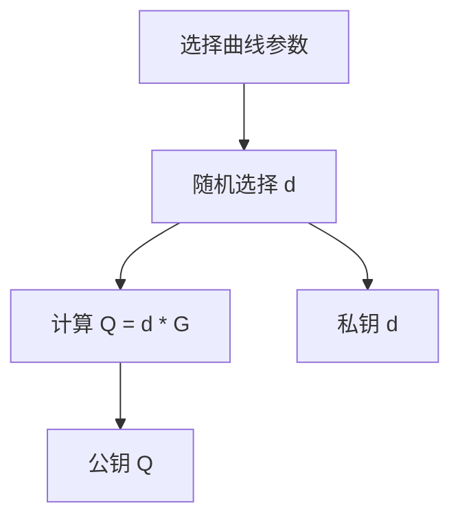
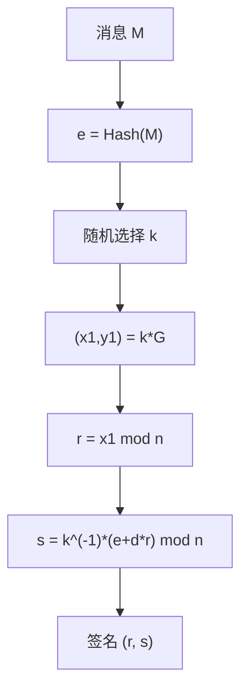
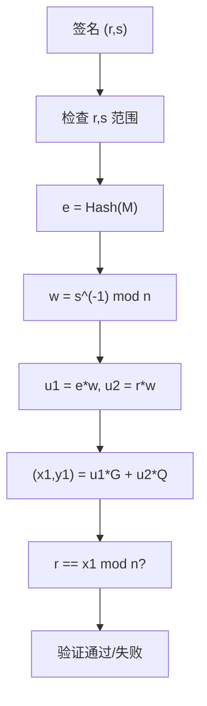
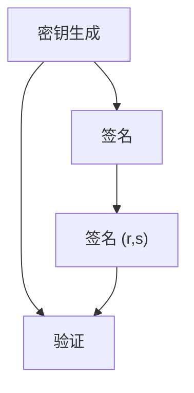
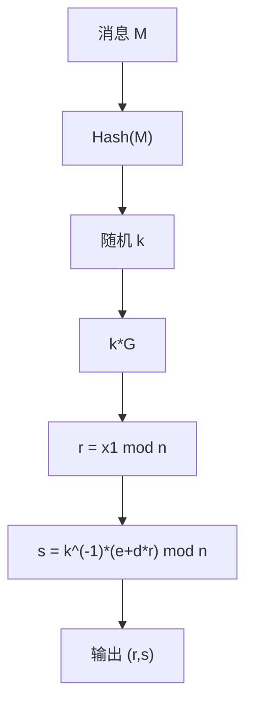
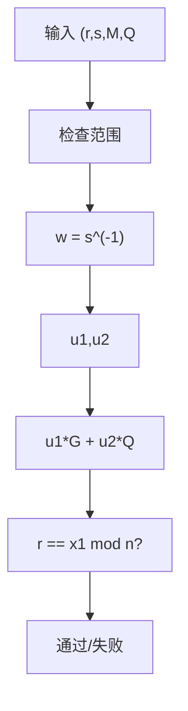

# ECDSA 算法详解

## 文档状态

已补全 ECDSA 算法核心原理、密钥生成、签名验证、C 语言实现框架、以及 OpenSSL/GMSSL 使用示例。

## 目录

1. 算法背景
2. 参数与记号
3. 数学基础
4. ECDSA 密钥生成
5. ECDSA 签名流程
6. ECDSA 验证流程
7. Mermaid 流程图
8. 数据结构设计
9. C 语言实现框架
10. 常用曲线参数
11. OpenSSL / GMSSL 使用
12. 测试向量与验证
13. 安全性分析
14. 工程建议
15. 与其他签名算法对比

## 1. 算法背景

ECDSA（Elliptic Curve Digital Signature Algorithm）是基于椭圆曲线密码学的数字签名算法，由 Scott Vanstone 于 1992 年提出。
ECDSA 是 DSA 在椭圆曲线上的类比，相比 RSA，在相同安全级别下使用更短的密钥。

ECDSA 广泛应用于：
- 比特币和以太坊等区块链系统
- TLS/SSL 证书签名
- 代码签名
- 移动设备认证

## 2. 参数与记号

- 椭圆曲线 `E`：定义在有限域 `GF(p)` 上，方程 `y^2 = x^3 + ax + b`。
- 基点 `G`：椭圆曲线上的一个固定点，阶为大素数 `n`。
- 阶 `n`：基点 `G` 的阶，通常为 256-bit 素数。
- 私钥 `d`：随机选择的整数，`1 ≤ d ≤ n-1`。
- 公钥 `Q`：椭圆曲线上的点，`Q = d * G`。
- 哈希函数 `H`：通常使用 SHA-256 或 SHA-512。

## 3. 数学基础

### 3.1 椭圆曲线运算

椭圆曲线上的点构成一个阿贝尔群，核心运算为点加法和点乘法。

**点加法**：给定曲线上两点 `P` 和 `Q`，计算 `R = P + Q`。

**点倍乘**：给定点 `P` 和整数 `k`，计算 `k * P = P + P + ... + P`（k 次）。

### 3.2 点加法公式

对于曲线 `y^2 = x^3 + ax + b (mod p)`：

若 `P = (x1, y1)`，`Q = (x2, y2)`，`P ≠ Q`：

```
λ = (y2 - y1) * (x2 - x1)^(-1) mod p
x3 = λ^2 - x1 - x2 mod p
y3 = λ * (x1 - x3) - y1 mod p
```

若 `P = Q`（点倍乘）：

```
λ = (3*x1^2 + a) * (2*y1)^(-1) mod p
x3 = λ^2 - 2*x1 mod p
y3 = λ * (x1 - x3) - y1 mod p
```

### 3.3 有限域运算

所有运算在 `GF(p)` 中进行，包括模加、模乘、模逆。

模逆使用扩展欧几里得算法或费马小定理：

```
a^(-1) = a^(p-2) mod p
```

## 4. ECDSA 密钥生成

密钥生成步骤：

1. 选择椭圆曲线参数 `(p, a, b, G, n, h)`。
2. 随机选择私钥 `d`，`1 ≤ d ≤ n-1`。
3. 计算公钥 `Q = d * G`。

伪码：

```
d = RandomInteger(1, n-1)
Q = PointMultiply(d, G)
PrivateKey = d
PublicKey = Q
```

### 4.1 ECDSA 密钥生成流程图



## 5. ECDSA 签名流程

签名步骤：

1. 计算消息哈希 `e = H(M)`。
2. 随机选择临时密钥 `k`，`1 ≤ k ≤ n-1`。
3. 计算点 `(x1, y1) = k * G`。
4. 计算 `r = x1 mod n`，若 `r = 0` 则重新选择 `k`。
5. 计算 `s = k^(-1) * (e + d * r) mod n`，若 `s = 0` 则重新选择 `k`。
6. 签名为 `(r, s)`。

伪码：

```
e = Hash(M)
k = RandomInteger(1, n-1)
(x1, y1) = PointMultiply(k, G)
r = x1 mod n
s = ModularInverse(k, n) * (e + d * r) mod n
Signature = (r, s)
```

### 5.1 ECDSA 签名流程图



## 6. ECDSA 验证流程

验证步骤：

1. 检查 `r` 和 `s` 是否在 `[1, n-1]` 范围内。
2. 计算消息哈希 `e = H(M)`。
3. 计算 `w = s^(-1) mod n`。
4. 计算 `u1 = e * w mod n`，`u2 = r * w mod n`。
5. 计算点 `(x1, y1) = u1 * G + u2 * Q`。
6. 验证 `r ≡ x1 mod n`。

伪码：

```
if r < 1 or r >= n or s < 1 or s >= n:
    return INVALID
e = Hash(M)
w = ModularInverse(s, n)
u1 = e * w mod n
u2 = r * w mod n
(x1, y1) = PointMultiply(u1, G) + PointMultiply(u2, Q)
return r == x1 mod n
```

### 6.1 ECDSA 验证流程图



## 7. Mermaid 流程图

### 7.1 ECDSA 完整流程



### 7.2 ECDSA 签名详细流程



### 7.3 ECDSA 验证详细流程



## 8. 数据结构设计

推荐数据结构：

- `u32 privateKey[8]`：256-bit 私钥。
- `u32 publicKeyX[8]`：公钥 X 坐标。
- `u32 publicKeyY[8]`：公钥 Y 坐标。
- `u32 signatureR[8]`：签名 r 分量。
- `u32 signatureS[8]`：签名 s 分量。

接口设计示例：

- `void ECDSA_GenerateKey(ECDSA_Context_S* context);`
- `void ECDSA_Sign(const u8* hash, size_t hashLen, u8* signature, size_t* sigLen, const ECDSA_Context_S* context);`
- `int ECDSA_Verify(const u8* hash, size_t hashLen, const u8* signature, size_t sigLen, const ECDSA_Context_S* context);`

## 9. C 语言实现框架

示例实现包含 ECDSA 核心运算（简化版，使用内部大数库）。

```c
#include <stdint.h>
#include <string.h>

typedef uint8_t u8;
typedef uint32_t u32;

#define ECDSA_P256_WORD_SIZE 8

typedef struct {
    u32 privateKey[ECDSA_P256_WORD_SIZE];
    u32 publicKeyX[ECDSA_P256_WORD_SIZE];
    u32 publicKeyY[ECDSA_P256_WORD_SIZE];
} ECDSA_Context_S;

typedef struct {
    u32 r[ECDSA_P256_WORD_SIZE];
    u32 s[ECDSA_P256_WORD_SIZE];
} ECDSA_Signature_S;

void ECDSA_GenerateKey(ECDSA_Context_S* context)
{
    (void)context;
}

void ECDSA_Sign(const u8* hash, size_t hashLen, ECDSA_Signature_S* sig, const ECDSA_Context_S* context)
{
    (void)hash;
    (void)hashLen;
    (void)sig;
    (void)context;
}

int ECDSA_Verify(const u8* hash, size_t hashLen, const ECDSA_Signature_S* sig, const ECDSA_Context_S* context)
{
    (void)hash;
    (void)hashLen;
    (void)sig;
    (void)context;
    return 0;
}
```

以上为 ECDSA 算法框架实现。完整实现需要大整数运算库和椭圆曲线点运算库支持，生产环境推荐使用 OpenSSL 等成熟库。

## 10. 常用曲线参数

### 10.1 P-256 (secp256r1 / prime256v1)

NIST 推荐曲线，应用最广泛：

- 素数 `p = 0xFFFFFFFF00000001000000000000000000000000FFFFFFFFFFFFFFFFFFFFFFFF`
- 参数 `a = p - 3`
- 参数 `b = 0x5AC635D8AA3A93E7B3EBBD55769886BC651D06B0CC53B0F63BCE3C3E27D2604B`
- 基点 `G` 的 X 坐标 `Gx = 0x6B17D1F2E12C4247F8BCE6E563A440F277037D812DEB33A0F4A13945D898C296`
- 基点 `G` 的 Y 坐标 `Gy = 0x4FE342E2FE1A7F9B8EE7EB4A7C0F9E162BCE33576B315ECECBB6406837BF51F5`
- 阶 `n = 0xFFFFFFFF00000000FFFFFFFFFFFFFFFFBCE6FAADA7179E84F3B9CAC2FC632551`
- 余因子 `h = 1`

### 10.2 P-384 (secp384r1)

- 密钥长度：384 位
- 安全级别：192 位
- 适用于高安全需求场景

### 10.3 P-521 (secp521r1)

- 密钥长度：521 位
- 安全级别：256 位
- 适用于极高安全需求场景

## 11. OpenSSL / GMSSL 使用

### OpenSSL ECDSA 密钥生成

```bash
openssl ecparam -name prime256v1 -genkey -noout -out ec_private.pem
openssl ec -in ec_private.pem -pubout -out ec_public.pem
```

### OpenSSL ECDSA 签名

```bash
openssl dgst -sha256 -sign ec_private.pem -out signature.bin message.txt
```

### OpenSSL ECDSA 验证

```bash
openssl dgst -sha256 -verify ec_public.pem -signature signature.bin message.txt
```

### OpenSSL 查看支持的曲线

```bash
openssl ecparam -list_curves
```

## 12. 测试向量与验证

### P-256 ECDSA 测试向量

RFC 6979 中的测试向量（简化）：

- 曲线：P-256
- 哈希函数：SHA-256
- 私钥 `d` 和消息哈希 `e` 为已知值
- 签名 `(r, s)` 为预期输出

### 验证方式

1. 生成 ECDSA 密钥对。
2. 使用私钥对消息哈希签名。
3. 使用公钥验证签名。
4. 篡改消息后验证应失败。

## 13. 安全性分析

ECDSA 的安全性基于椭圆曲线离散对数问题 (ECDLP) 的困难性。

- 256-bit ECDSA 提供约 128-bit 安全级别，等价于 3072-bit RSA。
- 临时密钥 `k` 必须使用密码学安全随机数生成器。
- `k` 的重用或泄露将导致私钥泄露。
- 必须使用确定性 nonce (RFC 6979) 或高质量 CSPRNG。

### 13.1 已知攻击

- Sony PS3 攻击：重复使用 `k` 导致私钥泄露。
- 侧信道攻击：通过测量签名时间推断 `k` 的信息。
- 无效曲线攻击：使用无效曲线点获取私钥信息。

## 14. 工程建议

- 生产环境首选成熟库实现，如 OpenSSL、GMSSL、libsecp256k1。
- 使用确定性 nonce (RFC 6979) 替代随机 `k`。
- 实现应使用恒定时间算法，防止侧信道攻击。
- 验证签名时必须检查 `r` 和 `s` 的范围。
- 推荐使用 P-256 或更高安全级别的曲线。

## 15. 与其他签名算法对比

| 算法 | 密钥长度 | 签名长度 | 安全级别 | 标准化 |
|------|---------|---------|---------|--------|
| RSA-2048 | 2048 bit | 256 字节 | 112 bit | PKCS#1 |
| ECDSA P-256 | 256 bit | 64 字节 | 128 bit | FIPS 186-4 |
| Ed25519 | 256 bit | 64 字节 | 128 bit | RFC 8032 |
| SM2 | 256 bit | 64 字节 | 128 bit | GB/T 32918 |

ECDSA 相比 RSA 的优势：更短的密钥和签名，更快的运算速度。
ECDSA 相比 Ed25519 的劣势：需要随机 `k`，实现更复杂，性能略低。
