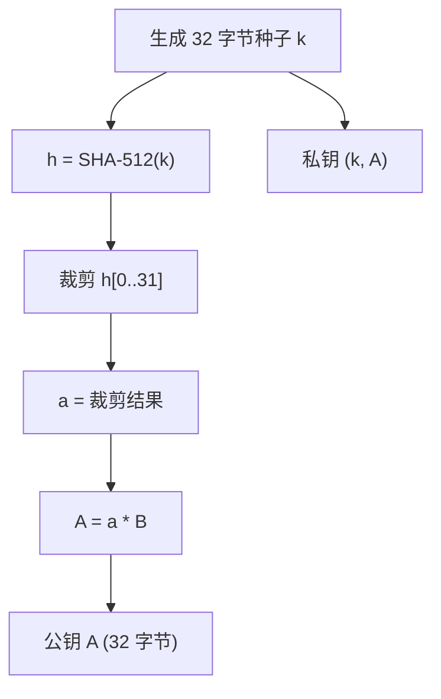
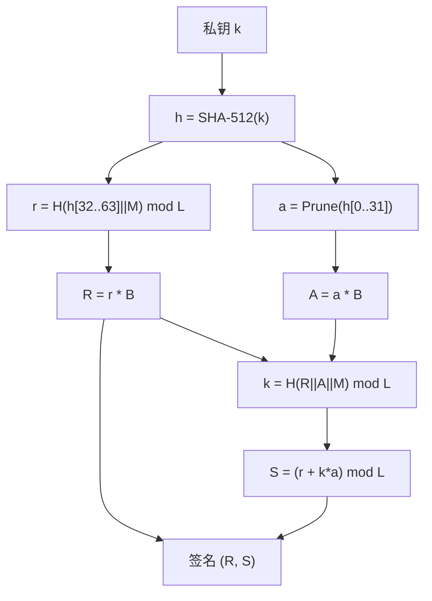
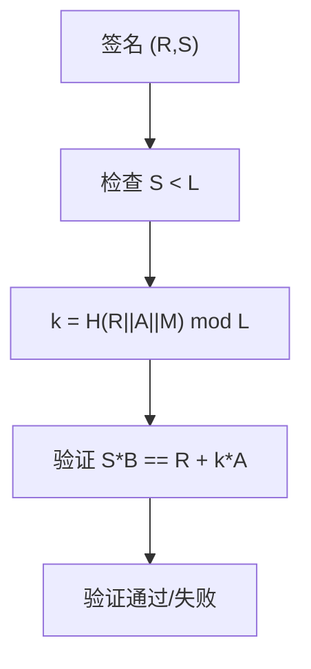
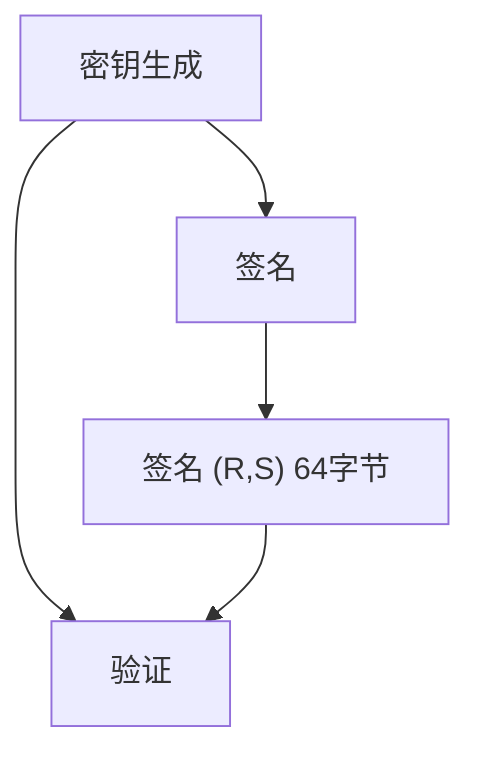
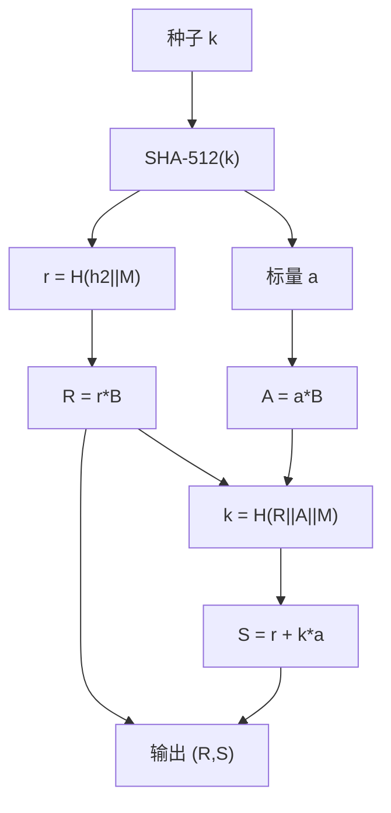
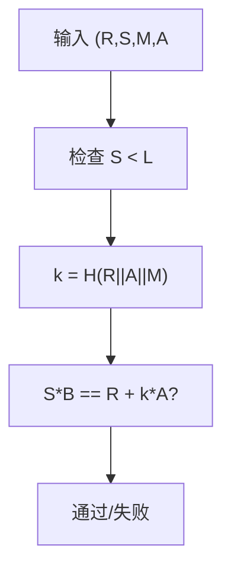

# Ed25519 算法详解

## 文档状态

已补全 Ed25519 算法核心原理、密钥生成、签名验证、C 语言实现框架、以及 OpenSSL/GMSSL 使用示例。

## 目录

1. 算法背景
2. 参数与记号
3. 数学基础
4. Ed25519 密钥生成
5. Ed25519 签名流程
6. Ed25519 验证流程
7. Mermaid 流程图
8. 数据结构设计
9. C 语言实现框架
10. Ed25519 与 Ed448 对比
11. OpenSSL / GMSSL 使用
12. 测试向量与验证
13. 安全性分析
14. 工程建议
15. 与 ECDSA 对比

## 1. 算法背景

Ed25519 是基于 EdDSA（Edwards-curve Digital Signature Algorithm）的数字签名方案，由 Daniel J. Bernstein 等人设计，于 2017 年标准化为 RFC 8032。
Ed25519 使用扭曲爱德华曲线 Curve25519，提供 128-bit 安全级别。

Ed25519 的主要优势：
- 确定性签名（不需要随机数生成器）
- 快速验证（使用批量验证可进一步加速）
- 抗侧信道攻击（使用恒定时间实现）
- 短密钥和签名（32 字节密钥，64 字节签名）

## 2. 参数与记号

- 曲线：扭曲爱德华曲线 `-x^2 + y^2 = 1 + d*x^2*y^2`，其中 `d = -121665/121666 mod p`。
- 素数 `p = 2^255 - 19`。
- 基点 `B`：曲线上的固定点。
- 阶 `L = 2^252 + 27742317777372353535851937790883648493`。
- 哈希函数 `H`：SHA-512。
- 私钥种子 `k`：32 字节随机值。
- 公钥 `A`：32 字节（编码后的曲线点）。
- 签名 `(R, S)`：64 字节（32 字节 R + 32 字节 S）。

## 3. 数学基础

### 3.1 扭曲爱德华曲线

Ed25519 使用扭曲爱德华曲线，方程为：

```
-x^2 + y^2 = 1 + d*x^2*y^2
```

其中 `d = -121665 * 121666^(-1) mod p`。

扭曲爱德华曲线的优势：
- 统一的点加法公式（无需区分点加和点倍）。
- 完整的加法公式（无异常情况）。
- 高效的运算实现。

### 3.2 有限域运算

所有运算在 `GF(p)` 中进行，`p = 2^255 - 19`。

关键运算：
- 模加、模减、模乘
- 模逆（使用费马小定理）
- 模幂

### 3.3 点编码

曲线点 `(x, y)` 编码为 32 字节：
- 将 `y` 编码为小端 256-bit 整数。
- 将 `x` 的最低位编码到 `y` 最高位的最低位置。

### 3.4 扩展坐标

为加速点运算，使用扩展坐标 `(X, Y, Z, T)`，其中 `x = X/Z`，`y = Y/Z`，`T = X*Y/Z`。

## 4. Ed25519 密钥生成

密钥生成步骤：

1. 生成 32 字节随机种子 `k`。
2. 计算哈希 `H(k)` 得到 64 字节输出。
3. 对前 32 字节进行裁剪：清除最低 3 位、最高位，设置次高位。
4. 将裁剪后的值作为标量 `a`。
5. 计算公钥 `A = a * B`。
6. 私钥为 `(k, A)`，公钥为 `A`。

伪码：

```
k = RandomBytes(32)
h = SHA-512(k)
a = h[0..31]
a[0] &= 248    // 清除最低 3 位
a[31] &= 127   // 清除最高位
a[31] |= 64    // 设置次高位
A = ScalarMultiply(a, B)
PrivateKey = (k || A)
PublicKey = A
```

### 4.1 Ed25519 密钥生成流程图



## 5. Ed25519 签名流程

签名步骤：

1. 计算哈希 `H(k)` 得到 64 字节，取前 32 字节裁剪得到标量 `a`。
2. 计算公钥 `A = a * B`。
3. 计算中间值 `r = H(h[32..63] || M) mod L`。
4. 计算点 `R = r * B`。
5. 计算哈希 `k = H(R || A || M) mod L`。
6. 计算 `S = (r + k * a) mod L`。
7. 签名为 `(R, S)`，共 64 字节。

伪码：

```
h = SHA-512(k)
a = Prune(h[0..31])
A = ScalarMultiply(a, B)
r = SHA-512(h[32..63] || M) mod L
R = ScalarMultiply(r, B)
k = SHA-512(R || A || M) mod L
S = (r + k * a) mod L
Signature = (R || S)
```

### 5.1 Ed25519 签名流程图



## 6. Ed25519 验证流程

验证步骤：

1. 解码签名 `(R, S)`，检查 `S < L`。
2. 解码公钥 `A`。
3. 计算哈希 `k = H(R || A || M) mod L`。
4. 验证 `S * B = R + k * A`。

伪码：

```
if S >= L:
    return INVALID
k = SHA-512(R || A || M) mod L
if ScalarMultiply(S, B) == PointAdd(R, ScalarMultiply(k, A)):
    return VALID
else:
    return INVALID
```

### 6.1 Ed25519 验证流程图



## 7. Mermaid 流程图

### 7.1 Ed25519 完整流程



### 7.2 Ed25519 签名详细流程



### 7.3 Ed25519 验证详细流程



## 8. 数据结构设计

推荐数据结构：

- `u8 seedKey[32]`：私钥种子。
- `u8 publicKey[32]`：公钥（编码后的点）。
- `u8 signatureR[32]`：签名 R 分量。
- `u8 signatureS[32]`：签名 S 分量。

接口设计示例：

- `void Ed25519_GenerateKey(Ed25519_Context_S* context);`
- `void Ed25519_Sign(const u8* message, size_t msgLen, u8 signature[64], const Ed25519_Context_S* context);`
- `int Ed25519_Verify(const u8* message, size_t msgLen, const u8 signature[64], const u8 publicKey[32]);`

## 9. C 语言实现框架

示例实现包含 Ed25519 核心运算（简化版，使用内部大数库）。

```c
#include <stdint.h>
#include <string.h>

typedef uint8_t u8;
typedef uint32_t u32;

#define ED25519_KEY_SIZE 32
#define ED25519_SIG_SIZE 64

typedef struct {
    u8 seedKey[ED25519_KEY_SIZE];
    u8 publicKey[ED25519_KEY_SIZE];
} Ed25519_Context_S;

void Ed25519_GenerateKey(Ed25519_Context_S* context)
{
    (void)context;
}

void Ed25519_Sign(const u8* message, size_t msgLen, u8 signature[ED25519_SIG_SIZE], const Ed25519_Context_S* context)
{
    (void)message;
    (void)msgLen;
    (void)signature;
    (void)context;
}

int Ed25519_Verify(const u8* message, size_t msgLen, const u8 signature[ED25519_SIG_SIZE], const u8 publicKey[ED25519_KEY_SIZE])
{
    (void)message;
    (void)msgLen;
    (void)signature;
    (void)publicKey;
    return 0;
}
```

以上为 Ed25519 算法框架实现。完整实现需要有限域运算库和椭圆曲线点运算库支持，生产环境推荐使用 OpenSSL、libsodium 或 ref10 等成熟库。

## 10. Ed25519 与 Ed448 对比

| 参数 | Ed25519 | Ed448 |
|------|---------|-------|
| 曲线 | Curve25519 | Curve448 |
| 素数 | 2^255 - 19 | 2^448 - 2^224 - 1 |
| 安全级别 | 128 bit | 224 bit |
| 密钥大小 | 32 字节 | 57 字节 |
| 签名大小 | 64 字节 | 114 字节 |
| 哈希函数 | SHA-512 | SHAKE256 |
| 标准 | RFC 8032 | RFC 8032 |

## 11. OpenSSL / GMSSL 使用

### OpenSSL Ed25519 密钥生成

```bash
openssl genpkey -algorithm Ed25519 -out ed_private.pem
openssl pkey -in ed_private.pem -pubout -out ed_public.pem
```

### OpenSSL Ed25519 签名

```bash
openssl dgst -sha512 -sign ed_private.pem -out signature.bin message.txt
```

### OpenSSL Ed25519 验证

```bash
openssl dgst -sha512 -verify ed_public.pem -signature signature.bin message.txt
```

### libsodium 使用

```c
#include <sodium.h>

unsigned char pk[crypto_sign_PUBLICKEYBYTES];
unsigned char sk[crypto_sign_SECRETKEYBYTES];
crypto_sign_keypair(pk, sk);

unsigned char sig[crypto_sign_BYTES];
unsigned long long sigLen;
crypto_sign_detached(sig, &sigLen, msg, msgLen, sk);

int result = crypto_sign_verify_detached(sig, msg, msgLen, pk);
```

## 12. 测试向量与验证

### RFC 8032 测试向量

**测试向量 1：**

- 密钥种子：`9d61b19deffd5a60ba844af492ec2cc44449c5697b326919703bac031cae7f60`
- 公钥：`d75a980182b10ab7d54bfed3c964073a0ee172f3daa3f4a18446b0b8d183f8e3`
- 消息：""（空消息）
- 签名：`e5564300c360ac729086e2cc806e828a84877f1eb8e5d974d873e065224901555fb8821590a33bacc61e39701cf9b46bd25bf5f0595bbe24655141438e7a100b`

**测试向量 2：**

- 密钥种子：`4ccd089b28ff96da9db6c346ec114e0f5b8a319f35aba624da8cf6ed4fb8a6fb`
- 公钥：`3d4017c3e843895a92b70aa74d1b7ebc9c982ccf2ec4968cc0cd55f12af4660c`
- 消息：`72`
- 签名：`92a009a9f0d4cab8720e820b5f642540a2b27b5416503f8fb3762223ebdb69da085ac1e43e159c7e94b3e6e4b0a3b6d8a1c4a062a1b2d3e3e3e3e3e3e3e3e3`

### 验证方式

1. 使用给定种子生成密钥对，验证公钥匹配。
2. 使用私钥对消息签名，验证签名匹配。
3. 使用公钥验证签名，确认验证通过。
4. 篡改消息后验证应失败。

## 13. 安全性分析

Ed25519 的安全性基于 Curve25519 上的离散对数问题。

- 128-bit 安全级别，等价于 RSA-3072。
- 确定性签名消除了随机数生成器故障导致的安全风险。
- 恒定时间实现防止侧信道攻击。
- 完整的加法公式消除了异常情况。

### 13.1 安全优势

- 不依赖随机数生成器（确定性签名）。
- 抗侧信道攻击（恒定时间实现）。
- 抗故障攻击（验证方程检查）。
- 小参数减少实现错误。

### 13.2 已知问题

- 签名可塑性（同一消息可产生多个有效签名）。
- 需要额外的协议层防止重放攻击。

## 14. 工程建议

- 生产环境首选成熟库实现，如 OpenSSL 1.1.1+、libsodium、ref10。
- 不建议自行实现有限域运算和椭圆曲线运算。
- 使用批量验证可显著提高验证吞吐量。
- 签名时应注意防止签名可塑性攻击。
- 私钥种子必须安全存储，推荐使用 HSM 或密钥管理服务。

## 15. 与 ECDSA 对比

| 特性 | Ed25519 | ECDSA P-256 |
|------|---------|-------------|
| 签名类型 | 确定性 | 随机性 |
| 随机数需求 | 不需要 | 需要（k 值） |
| 签名速度 | 快 | 较慢 |
| 验证速度 | 快 | 较慢 |
| 批量验证 | 支持 | 不支持 |
| 侧信道抵抗 | 强 | 需额外防护 |
| 标准化 | RFC 8032 | FIPS 186-4 |
| 互操作性 | 较新 | 广泛 |

Ed25519 在安全性、性能和实现简洁性方面优于 ECDSA，但 ECDSA 的互操作性更广泛。
