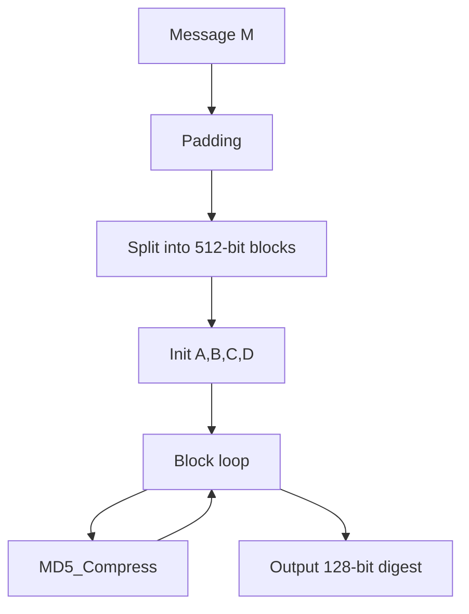
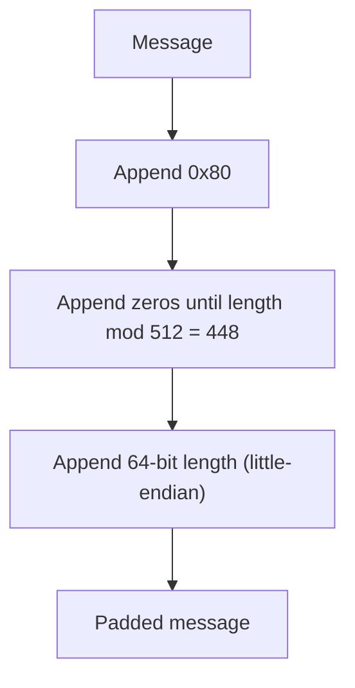

# MD5 算法详解

## 文档状态

已补全 MD5 算法核心原理、运算流程、C 语言实现框架、以及 OpenSSL/GMSSL 使用示例。

## 目录

1. 算法背景
2. 参数与记号
3. 数学基础
4. MD5 核心变换
5. MD5 压缩函数
6. MD5 哈希流程
7. Mermaid 流程图
8. 数据结构设计
9. C 语言实现框架
10. OpenSSL / GMSSL 使用
11. 测试向量与验证
12. 安全性分析
13. 工程建议

## 1. 算法背景

MD5（Message-Digest Algorithm 5）由 Ronald L. Rivest 于 1991 年设计，作为 MD4 的增强版本。
1992 年发布为 RFC 1321。

MD5 是一种密码散列函数，将任意长度的消息映射为固定 128 位（16 字节）摘要值。

- 输入：任意长度的消息
- 输出：128 位（16 字节）摘要
- 分组大小：512 位（64 字节）
- 字长：32 位

## 2. 参数与记号

- 消息 `M`：任意长度的比特串
- 摘要 `H`：128 位输出
- 状态变量：`A, B, C, D`，各为 32 位
- 轮数：4 轮，每轮 16 步，共 64 步
- 消息字 `X[k]`：512 位分组中的第 `k` 个 32 位字（`k = 0..15`）
- 正弦表 `T[i]`：第 `i` 步的加法常数，`T[i] = floor(2^32 * |sin(i+1)|)`

## 3. 数学基础

MD5 的核心运算基于 32 位字的模加法、按位逻辑运算和循环左移。

### 3.1 辅助逻辑函数

- 第 1 轮（步 0-15）：`F(X, Y, Z) = (X & Y) | (~X & Z)`
- 第 2 轮（步 16-31）：`G(X, Y, Z) = (X & Z) | (Y & ~Z)`
- 第 3 轮（步 32-47）：`H(X, Y, Z) = X ^ Y ^ Z`
- 第 4 轮（步 48-63）：`I(X, Y, Z) = Y ^ (X | ~Z)`

### 3.2 循环左移

```
ROTL(x, n) = (x << n) | (x >> (32 - n))
```

### 3.3 消息字索引

- 第 1 轮：`k = i`（顺序）
- 第 2 轮：`k = (1 + 5*i) mod 16`
- 第 3 轮：`k = (5 + 3*i) mod 16`
- 第 4 轮：`k = (7*i) mod 16`

### 3.4 移位计数

```
Round 1: 7, 12, 17, 22, 7, 12, 17, 22, 7, 12, 17, 22, 7, 12, 17, 22
Round 2: 5,  9, 14, 20, 5,  9, 14, 20, 5,  9, 14, 20, 5,  9, 14, 20
Round 3: 4, 11, 16, 23, 4, 11, 16, 23, 4, 11, 16, 23, 4, 11, 16, 23
Round 4: 6, 10, 15, 21, 6, 10, 15, 21, 6, 10, 15, 21, 6, 10, 15, 21
```

## 4. MD5 核心变换

每一步的核心变换为：

```
a = b + ROTL(a + f(b,c,d) + T[i] + X[k], s[i])
```

执行后，状态变量循环交换：`a = d; d = c; c = b; b = temp`

## 5. MD5 压缩函数

### 5.1 填充

1. 在消息末尾追加 `1` 比特（即字节 `0x80`）
2. 追加 `0` 比特直到长度 ≡ 448 (mod 512)
3. 追加 64 位小端表示的原始消息长度（比特数）

### 5.2 初始值

```
A = 0x67452301
B = 0xEFCDAB89
C = 0x98BADCFE
D = 0x10325476
```

### 5.3 压缩函数伪码

```
function MD5_Compress(X[0..15], A, B, C, D):
    a = A; b = B; c = C; d = D
    for i in 0..63:
        if i < 16:   f = F(b,c,d); k = i
        elif i < 32: f = G(b,c,d); k = (1+5*i)%16
        elif i < 48: f = H(b,c,d); k = (5+3*i)%16
        else:         f = I(b,c,d); k = (7*i)%16
        temp = a + f + T[i] + X[k]
        temp = ROTL(temp, s[i])
        a = d; d = c; c = b; b = b + temp
    A += a; B += b; C += c; D += d
```

## 6. MD5 哈希流程

```
M' = Pad(M)
(A,B,C,D) = (0x67452301, 0xEFCDAB89, 0x98BADCFE, 0x10325476)
for each 512-bit block X in M':
    (A,B,C,D) = MD5_Compress(X, A, B, C, D)
Digest = A || B || C || D  (小端字节序)
```

## 7. Mermaid 流程图

### 7.1 MD5 总体流程



### 7.2 MD5 填充流程



## 8. 数据结构设计

```c
typedef struct {
    u32 state[4];
    u32 count[2];
    u8 buffer[64];
} MD5_Context_S;
```

接口设计：

- `void MD5_Init(MD5_Context_S* context);`
- `void MD5_Update(MD5_Context_S* context, const u8* input, size_t inputLen);`
- `void MD5_Final(u8 digest[16], MD5_Context_S* context);`
- `void MD5_Hash(const u8* input, size_t inputLen, u8 digest[16]);`

## 9. C 语言实现框架

```c
#include <stdint.h>
#include <string.h>

typedef uint8_t u8;
typedef uint32_t u32;

static const u32 T[64] = {
    0xD76AA478,0xE8C7B756,0x242070DB,0xC1BDCEEE,0xF57C0FAF,0x4787C62A,0xA8304613,0xFD469501,
    0x698098D8,0x8B44F7AF,0xFFFF5BB1,0x895CD7BE,0x6B901122,0xFD987193,0xA679438E,0x49B40821,
    0xF61E2562,0xC040B340,0x265E5A51,0xE9B6C7AA,0xD62F105D,0x02441453,0xD8A1E681,0xE7D3FBC8,
    0x21E1CDE6,0xC33707D6,0xF4D50D87,0x455A14ED,0xA9E3E905,0xFCEFA3F8,0x676F02D9,0x8D2A4C8A,
    0xFFFA3942,0x8771F681,0x6D9D6122,0xFDE5380C,0xA4BEEA44,0x4BDECFA9,0xF6BB4B60,0xBEBFBC70,
    0x289B7EC6,0xEAA127FA,0xD4EF3085,0x04881D05,0xD9D4D039,0xE6DB99E5,0x1FA27CF8,0xC4AC5665,
    0xF4292244,0x432AFF97,0xAB9423A7,0xFC93A039,0x655B59C3,0x8F0CCC92,0xFFEFF47D,0x85845DD1,
    0x6FA87E4F,0xFE2CE6E0,0xA3014314,0x4E0811A1,0xF7537E82,0xBD3AF235,0x2AD7D2BB,0xEB86D391
};

static inline u32 ROTL(u32 x, int n) { return (x << n) | (x >> (32 - n)); }
static inline u32 F(u32 x, u32 y, u32 z) { return (x & y) | (~x & z); }
static inline u32 G(u32 x, u32 y, u32 z) { return (x & z) | (y & ~z); }
static inline u32 H(u32 x, u32 y, u32 z) { return x ^ y ^ z; }
static inline u32 I(u32 x, u32 y, u32 z) { return y ^ (x | ~z); }
```

## 10. OpenSSL / GMSSL 使用

```bash
echo -n "abc" | openssl md5
echo -n "abc" | openssl dgst -md5 -hex
echo -n "abc" | gmssl md5
```

## 11. 测试向量与验证

| 输入 | MD5 摘要 |
|------|----------|
| `""` | `d41d8cd98f00b204e9800998ecf8427e` |
| `"a"` | `0cc175b9c0f1b6a831c399e269772661` |
| `"abc"` | `900150983cd24fb0d6963f7d28e17f72` |
| `"message digest"` | `f96b697d7cb7938d525a2f31aaf161d0` |
| `"abcdefghijklmnopqrstuvwxyz"` | `c3fcd3d76192e4007dfb496cca67e13b` |

## 12. 安全性分析

MD5 已被证明存在实际碰撞攻击，**不推荐用于安全敏感场景**：

- 2004 年王小云等人发现 MD5 碰撞攻击
- 推荐替代：SHA-256、SHA-3 或 SM3

## 13. 工程建议

- 生产环境首选 SHA-256 或更强的散列算法。
- MD5 仅可用于非安全目的（校验和、数据去重）。
- 密码存储应使用 bcrypt、scrypt 或 Argon2。
