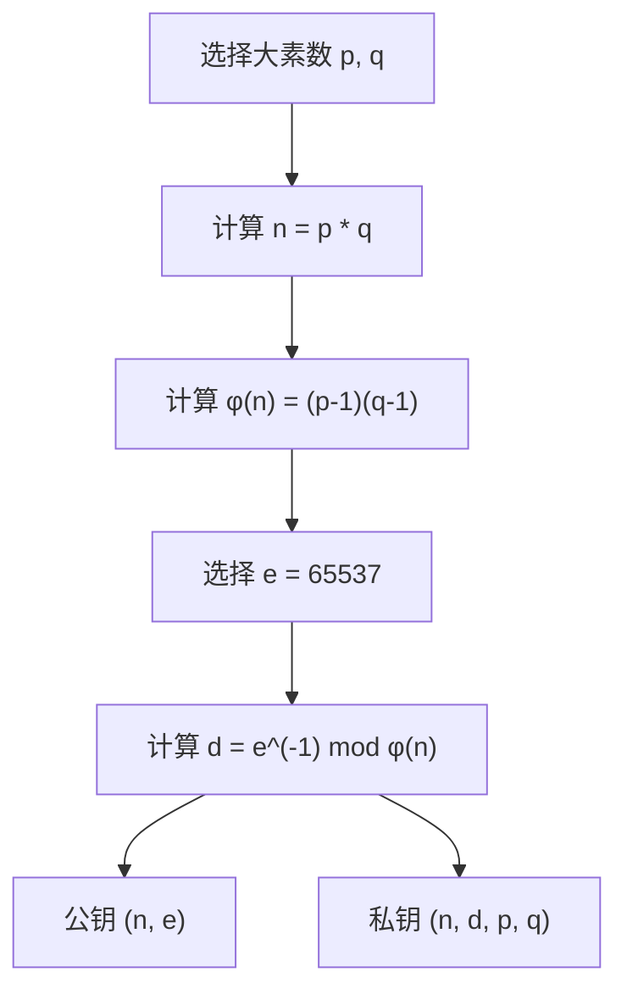
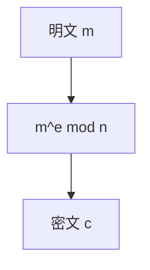
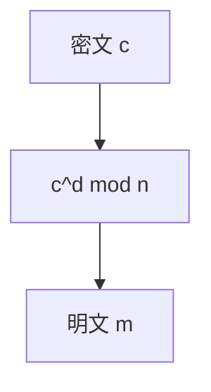
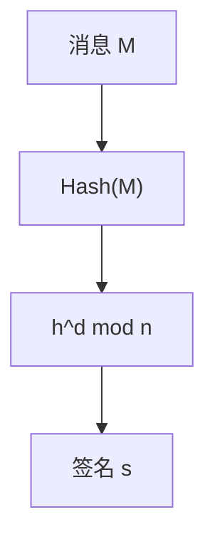
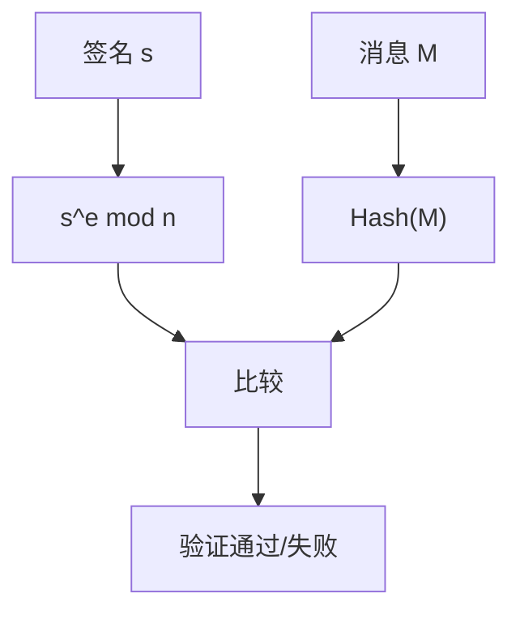
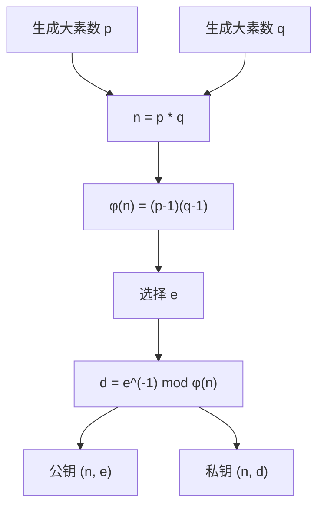
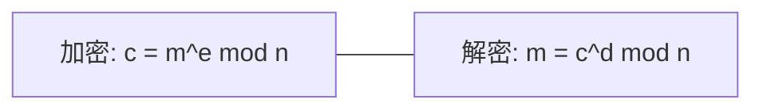
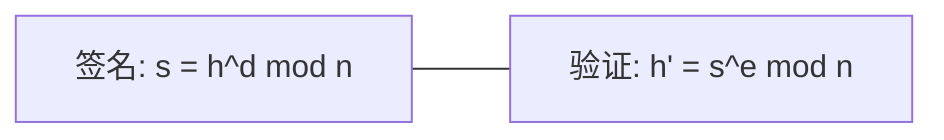

# RSA 算法详解

## 文档状态

已补全 RSA 算法核心原理、密钥生成、加解密流程、签名验证、C 语言实现框架、以及 OpenSSL/GMSSL 使用示例。

## 目录

1. 算法背景
2. 参数与记号
3. 数学基础
4. RSA 密钥生成
5. RSA 加密流程
6. RSA 解密流程
7. RSA 签名与验证
8. Mermaid 流程图
9. 数据结构设计
10. C 语言实现框架
11. RSA-OAEP 填充方案
12. OpenSSL / GMSSL 使用
13. 测试向量与验证
14. 安全性分析
15. 工程建议
16. 参数选择建议

## 1. 算法背景

RSA 由 Ron Rivest、Adi Shamir 和 Leonard Adleman 于 1977 年提出，是最早的公钥密码系统之一。
RSA 的安全性基于大整数分解问题的困难性。

RSA 广泛应用于：
- 数字签名与验证
- 密钥交换与密钥封装
- 身份认证
- SSL/TLS 协议

## 2. 参数与记号

- `p, q`：两个大素数（通常各为 1024 位以上）。
- `n = p * q`：模数，RSA 公钥的一部分。
- `φ(n) = (p-1)(q-1)`：欧拉函数值。
- `e`：公钥指数，通常选择 65537 (0x10001)。
- `d`：私钥指数，满足 `e * d ≡ 1 (mod φ(n))`。
- 公钥：`(n, e)`。
- 私钥：`(n, d)` 或 `(p, q, d)`。

## 3. 数学基础

### 3.1 模幂运算

RSA 的核心运算为模幂运算：

```
c = m^e mod n
m = c^d mod n
```

模幂运算通常使用平方-乘法算法（Square-and-Multiply）实现。

### 3.2 欧拉定理

若 `gcd(m, n) = 1`，则：

```
m^φ(n) ≡ 1 (mod n)
```

由此可得：

```
m^(e*d) ≡ m (mod n)
```

### 3.3 中国剩余定理 (CRT)

使用 CRT 可以加速 RSA 解密：

1. 计算 `m1 = c^d mod p`，`m2 = c^d mod q`。
2. 使用 CRT 合并：`m = m1 * q * q_inv + m2 * p * p_inv mod n`。

CRT 加速约 4 倍。

## 4. RSA 密钥生成

密钥生成步骤：

1. 随机选择两个大素数 `p` 和 `q`，`|p| ≈ |q|`。
2. 计算 `n = p * q`。
3. 计算 `φ(n) = (p-1)(q-1)`。
4. 选择公钥指数 `e`，满足 `1 < e < φ(n)` 且 `gcd(e, φ(n)) = 1`。
5. 计算私钥指数 `d = e^(-1) mod φ(n)`。

伪码：

```
p = RandomPrime(keyBits/2)
q = RandomPrime(keyBits/2)
n = p * q
phi = (p-1) * (q-1)
e = 65537
d = ModularInverse(e, phi)
PublicKey = (n, e)
PrivateKey = (n, d, p, q)
```

### 4.1 RSA 密钥生成流程图



## 5. RSA 加密流程

RSA 加密步骤：

1. 将明文 `m` 表示为整数，满足 `0 ≤ m < n`。
2. 计算密文 `c = m^e mod n`。

伪码：

```
c = ModularExponentiation(m, e, n)
```

### 5.1 RSA 加密流程图



## 6. RSA 解密流程

RSA 解密步骤：

1. 接收密文 `c`。
2. 计算明文 `m = c^d mod n`。

伪码：

```
m = ModularExponentiation(c, d, n)
```

### 6.1 RSA 解密流程图



## 7. RSA 签名与验证

### 7.1 签名

1. 对消息 `M` 计算哈希值 `h = Hash(M)`。
2. 计算签名 `s = h^d mod n`。

### 7.2 验证

1. 计算 `h' = s^e mod n`。
2. 计算消息哈希 `h = Hash(M)`。
3. 比较 `h'` 与 `h`，若相等则验证通过。

伪码：

```
签名: s = ModularExponentiation(Hash(M), d, n)
验证: ModularExponentiation(s, e, n) == Hash(M)
```

### 7.3 RSA 签名流程图



### 7.4 RSA 验证流程图



## 8. Mermaid 流程图

### 8.1 RSA 密钥生成



### 8.2 RSA 加解密



### 8.3 RSA 签名验证



## 9. 数据结构设计

推荐数据结构：

- `uint8_t modulus[RSA_MAX_MODULUS_BYTES]`：模数 n。
- `uint8_t publicExp[RSA_MAX_EXP_BYTES]`：公钥指数 e。
- `uint8_t privateExp[RSA_MAX_EXP_BYTES]`：私钥指数 d。
- `uint8_t primeP[RSA_MAX_MODULUS_BYTES/2]`：素数 p。
- `uint8_t primeQ[RSA_MAX_MODULUS_BYTES/2]`：素数 q。

接口设计示例：

- `void RSA_GenerateKey(int keyBits, RSA_Context_S* context);`
- `void RSA_Encrypt(const u8* plaintext, size_t ptLen, u8* ciphertext, size_t* ctLen, const RSA_Context_S* context);`
- `void RSA_Decrypt(const u8* ciphertext, size_t ctLen, u8* plaintext, size_t* ptLen, const RSA_Context_S* context);`
- `void RSA_Sign(const u8* hash, size_t hashLen, u8* signature, size_t* sigLen, const RSA_Context_S* context);`
- `int RSA_Verify(const u8* hash, size_t hashLen, const u8* signature, size_t sigLen, const RSA_Context_S* context);`

## 10. C 语言实现框架

示例实现包含 RSA 核心运算（简化版，使用内部大数库）。

```c
#include <stdint.h>
#include <string.h>

typedef uint8_t u8;
typedef uint32_t u32;

#define RSA_1024_WORD_SIZE 32

typedef struct {
    u32 modulus[RSA_1024_WORD_SIZE];
    u32 publicExp[1];
    u32 privateExp[RSA_1024_WORD_SIZE];
    u32 primeP[RSA_1024_WORD_SIZE / 2];
    u32 primeQ[RSA_1024_WORD_SIZE / 2];
    int keyBits;
} RSA_Context_S;

static u32 ModularExponentiation(u32 base, u32 exp, u32 mod)
{
    u32 result = 1;
    base %= mod;
    while (exp > 0) {
        if (exp & 1) {
            result = (u32)((u64)result * base % mod);
        }
        exp >>= 1;
        base = (u32)((u64)base * base % mod);
    }
    return result;
}

static u32 ExtendedGcd(u32 a, u32 b, u32* x, u32* y)
{
    if (a == 0) {
        *x = 0;
        *y = 1;
        return b;
    }
    u32 x1, y1;
    u32 gcd = ExtendedGcd(b % a, a, &x1, &y1);
    *x = y1 - (b / a) * x1;
    *y = x1;
    return gcd;
}

static u32 ModularInverse(u32 a, u32 m)
{
    u32 x, y;
    ExtendedGcd(a, m, &x, &y);
    return (x % m + m) % m;
}

void RSA_GenerateKey(int keyBits, RSA_Context_S* context)
{
    context->keyBits = keyBits;
    context->publicExp[0] = 65537UL;
}

void RSA_Encrypt(const u8* plaintext, size_t ptLen, u8* ciphertext, size_t* ctLen, const RSA_Context_S* context)
{
    (void)plaintext;
    (void)ptLen;
    (void)ciphertext;
    (void)ctLen;
    (void)context;
}

void RSA_Decrypt(const u8* ciphertext, size_t ctLen, u8* plaintext, size_t* ptLen, const RSA_Context_S* context)
{
    (void)ciphertext;
    (void)ctLen;
    (void)plaintext;
    (void)ptLen;
    (void)context;
}

void RSA_Sign(const u8* hash, size_t hashLen, u8* signature, size_t* sigLen, const RSA_Context_S* context)
{
    (void)hash;
    (void)hashLen;
    (void)signature;
    (void)sigLen;
    (void)context;
}

int RSA_Verify(const u8* hash, size_t hashLen, const u8* signature, size_t sigLen, const RSA_Context_S* context)
{
    (void)hash;
    (void)hashLen;
    (void)signature;
    (void)sigLen;
    (void)context;
    return 0;
}
```

以上为 RSA 算法框架实现。完整实现需要大整数运算库支持，生产环境推荐使用 OpenSSL 等成熟库。

## 11. RSA-OAEP 填充方案

原始 RSA（教科书 RSA）直接对明文进行模幂运算，存在严重安全问题。实际应用中必须使用填充方案。

### 11.1 PKCS#1 v1.5 填充

加密格式：

```
0x00 || 0x02 || PS || 0x00 || M
```

其中 `PS` 为至少 8 字节的非零随机填充字节。

### 11.2 OAEP 填充（推荐）

OAEP (Optimal Asymmetric Encryption Padding) 提供可证明安全性：

1. 选择哈希函数 `Hash` 和掩码生成函数 `MGF`。
2. 生成随机种子 `seed`（哈希输出长度）。
3. 计算 `dbMask = MGF(seed, nLen - hLen - 1)`。
4. 计算 `maskedDB = DB ⊕ dbMask`。
5. 计算 `seedMask = MGF(maskedDB, hLen)`。
6. 计算 `maskedSeed = seed ⊕ seedMask`。
7. 输出 `0x00 || maskedSeed || maskedDB`。

### 11.3 PSS 签名填充（推荐）

PSS (Probabilistic Signature Scheme) 为 RSA 签名提供随机化填充：

1. 生成随机盐值 `salt`。
2. 计算 `M' = 0x00*8 || Hash(M) || salt`。
3. 计算 `H = Hash(M')`。
4. 生成 `DB = PS || 0x01 || salt`。
5. 计算 `dbMask = MGF(H, emLen - hLen - 1)`。
6. 计算 `maskedDB = DB ⊕ dbMask`。
7. 输出 `maskedDB || H || 0xbc`。

## 12. OpenSSL / GMSSL 使用

### OpenSSL RSA 密钥生成

```bash
openssl genrsa -out private.pem 2048
openssl rsa -in private.pem -pubout -out public.pem
```

### OpenSSL RSA 加密

```bash
openssl rsautl -encrypt -pubin -inkey public.pem -in plain.txt -out cipher.bin
```

### OpenSSL RSA 解密

```bash
openssl rsautl -decrypt -inkey private.pem -in cipher.bin -out plain_out.txt
```

### OpenSSL RSA 签名

```bash
openssl dgst -sha256 -sign private.pem -out signature.bin message.txt
```

### OpenSSL RSA 验证

```bash
openssl dgst -sha256 -verify public.pem -signature signature.bin message.txt
```

### OpenSSL RSA-OAEP 加密

```bash
openssl rsautl -encrypt -pubin -inkey public.pem -oaep -in plain.txt -out cipher.bin
```

## 13. 测试向量与验证

### RSA-2048 示例

PKCS#1 v2.2 附录中的测试向量（简化）：

- 公钥指数 `e = 65537`
- 模数 `n` 为 2048-bit 整数
- 明文 `m` 为小于 `n` 的整数
- 密文 `c = m^e mod n`

### 验证方式

1. 生成 RSA 密钥对。
2. 使用公钥加密明文。
3. 使用私钥解密密文，验证是否还原为明文。
4. 使用私钥签名消息哈希。
5. 使用公钥验证签名。

## 14. 安全性分析

RSA 的安全性基于大整数分解问题的困难性。

- 1024 位密钥已不再安全，推荐至少 2048 位。
- 2048 位密钥预计安全至 2030 年左右。
- 3072 位或 4096 位密钥提供更长期的安全性。
- 必须使用 OAEP/PSS 填充方案，禁止使用教科书 RSA。
- 侧信道攻击（时间攻击、故障攻击）需要恒定时间实现。

### 14.1 已知攻击

- Bleichenbacher 攻击：针对 PKCS#1 v1.5 填充的 Oracle 攻击。
- 时间攻击：通过测量解密时间推断私钥信息。
- 共模攻击：同一模数不同公钥指数下的攻击。
- 小指数攻击：`e` 过小且明文过小时的攻击。

## 15. 工程建议

- 生产环境首选成熟库实现，如 OpenSSL、GMSSL、Libgcrypt。
- 禁止使用教科书 RSA，必须配合 OAEP/PSS 填充方案。
- 密钥长度至少 2048 位，推荐 3072 位或以上。
- 实现应使用恒定时间算法，防止侧信道攻击。
- 私钥必须安全存储，推荐使用 HSM 或密钥管理服务。
- 定期轮换密钥，避免长期使用同一密钥对。

## 16. 参数选择建议

| 安全级别 | 密钥长度 | 适用场景 |
|---------|---------|---------|
| 128-bit | 3072 位 | 长期安全 |
| 112-bit | 2048 位 | 当前标准 |
| 80-bit  | 1024 位 | 已不推荐 |

公钥指数 `e` 的选择：
- 推荐 `e = 65537`，兼顾安全性与效率。
- 避免使用 `e = 3`，存在安全风险。
