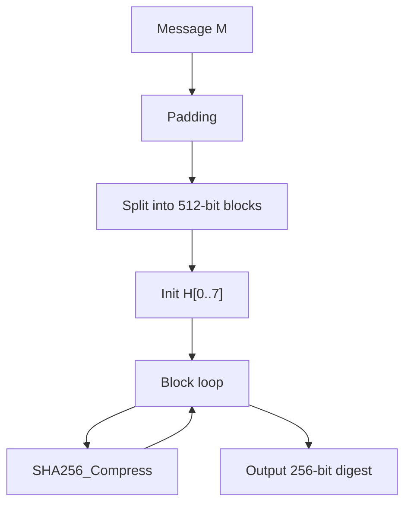

# SHA-256 算法详解

## 文档状态

已补全 SHA-256 算法核心原理、运算流程、C 语言实现框架、以及 OpenSSL/GMSSL 使用示例。

## 目录

1. 算法背景
2. 参数与记号
3. 数学基础
4. SHA-256 核心变换
5. SHA-256 压缩函数
6. SHA-256 哈希流程
7. Mermaid 流程图
8. 数据结构设计
9. C 语言实现框架
10. OpenSSL / GMSSL 使用
11. 测试向量与验证
12. 安全性分析
13. 工程建议

## 1. 算法背景

SHA-256（Secure Hash Algorithm 256-bit）由 NSA 设计，NIST 于 2001 年发布为 FIPS 180-2（现 FIPS 180-4）。
属于 SHA-2 家族，是当前最广泛使用的安全散列算法之一。

- 输入：任意长度的消息
- 输出：256 位（32 字节）摘要
- 分组大小：512 位（64 字节）
- 字长：32 位
- 轮数：64

## 2. 参数与记号

- 消息 `M`：任意长度的比特串
- 摘要 `H`：256 位输出，由 8 个 32 位字 `H[0]..H[7]` 组成
- 消息调度 `W[0..63]`：64 个 32 位字
- 工作变量 `a, b, c, d, e, f, g, h`
- 常数 `K[0..63]`：64 个 32 位轮常数

## 3. 数学基础

- 选择函数：`Ch(x, y, z) = (x & y) ^ (~x & z)`
- 多数函数：`Maj(x, y, z) = (x & y) ^ (x & z) ^ (y & z)`
- 大 Σ0：`Σ0(x) = ROTR(2, x) ^ ROTR(13, x) ^ ROTR(22, x)`
- 大 Σ1：`Σ1(x) = ROTR(6, x) ^ ROTR(11, x) ^ ROTR(25, x)`
- 小 σ0：`σ0(x) = ROTR(7, x) ^ ROTR(18, x) ^ SHR(3, x)`
- 小 σ1：`σ1(x) = ROTR(17, x) ^ ROTR(19, x) ^ SHR(10, x)`

消息调度扩展：`W[i] = σ1(W[i-2]) + W[i-7] + σ0(W[i-15]) + W[i-16]` (16 <= i <= 63)

## 4. SHA-256 核心变换

```
T1 = h + Σ1(e) + Ch(e, f, g) + K[i] + W[i]
T2 = Σ0(a) + Maj(a, b, c)
h = g; g = f; f = e; e = d + T1; d = c; c = b; b = a; a = T1 + T2
```

## 5. SHA-256 压缩函数

### 填充

1. 追加 `1` 比特（`0x80`）
2. 追加 `0` 比特直到长度 ≡ 448 (mod 512)
3. 追加 64 位大端消息长度

### 初始哈希值

```
H[0] = 0x6A09E667    H[4] = 0x510E527F
H[1] = 0xBB67AE85    H[5] = 0x9B05688C
H[2] = 0x3C6EF372    H[6] = 0x1F83D9AB
H[3] = 0xA54FF53A    H[7] = 0x5BE0CD19
```

## 6. SHA-256 哈希流程

1. 填充消息
2. 按 512 位分组
3. 初始化 `H[0..7]`
4. 对每个分组执行压缩函数
5. 按大端序输出 256 位摘要

## 7. Mermaid 流程图



## 8. 数据结构设计

```c
typedef struct {
    u32 state[8];
    u64 bitCount;
    u8 buffer[64];
    size_t bufferLen;
} SHA256_Context_S;
```

## 9. C 语言实现框架

```c
static const u32 K[64] = {
    0x428A2F98,0x71374491,0xB5C0FBCF,0xE9B5DBA5,0x3956C25B,0x59F111F1,0x923F82A4,0xAB1C5ED5,
    0xD807AA98,0x12835B01,0x243185BE,0x550C7DC3,0x72BE5D74,0x80DEB1FE,0x9BDC06A7,0xC19BF174,
    0xE49B69C1,0xEFBE4786,0x0FC19DC6,0x240CA1CC,0x2DE92C6F,0x4A7484AA,0x5CB0A9DC,0x76F988DA,
    0x983E5152,0xA831C66D,0xB00327C8,0xBF597FC7,0xC6E00BF3,0xD5A79147,0x06CA6351,0x14292967,
    0x27B70A85,0x2E1B2138,0x4D2C6DFC,0x53380D13,0x650A7354,0x766A0ABB,0x81C2C92E,0x92722C85,
    0xA2BFE8A1,0xA81A664B,0xC24B8B70,0xC76C51A3,0xD192E819,0xD6990624,0xF40E3585,0x106AA070,
    0x19A4C116,0x1E376C08,0x2748774C,0x34B0BCB5,0x391C0CB3,0x4ED8AA4A,0x5B9CCA4F,0x682E6FF3,
    0x748F82EE,0x78A5636F,0x84C87814,0x8CC70208,0x90BEFFFA,0xA4506CEB,0xBEF9A3F7,0xC67178F2
};

#define ROTR(x,n) (((x)>>(n))|((x)<<(32-(n))))
#define CH(x,y,z)  (((x)&(y))^((~(x))&(z)))
#define MAJ(x,y,z) (((x)&(y))^((x)&(z))^((y)&(z)))
#define SIG0(x)    (ROTR(x,2)^ROTR(x,13)^ROTR(x,22))
#define SIG1(x)    (ROTR(x,6)^ROTR(x,11)^ROTR(x,25))
```

## 10. OpenSSL / GMSSL 使用

```bash
echo -n "abc" | openssl dgst -sha256
openssl dgst -sha256 -hex file.bin
echo -n "abc" | gmssl dgst -sha256
```

## 11. 测试向量与验证

| 输入 | SHA-256 摘要 |
|------|--------------|
| `""` | `e3b0c44298fc1c149afbf4c8996fb92427ae41e4649b934ca495991b7852b855` |
| `"abc"` | `ba7816bf8f01cfea414140de5dae2223b00361a396177a9cb41042eab849ed7` |

## 12. 安全性分析

- 256 位输出，128 位碰撞安全边界
- 目前未发现实际碰撞攻击
- 广泛用于 TLS、区块链、数字签名

## 13. 工程建议

- SHA-256 是当前推荐的通用散列算法。
- 生产环境首选 OpenSSL、GMSSL 等成熟库。
- 密码存储推荐 PBKDF2-HMAC-SHA256 或 Argon2。
