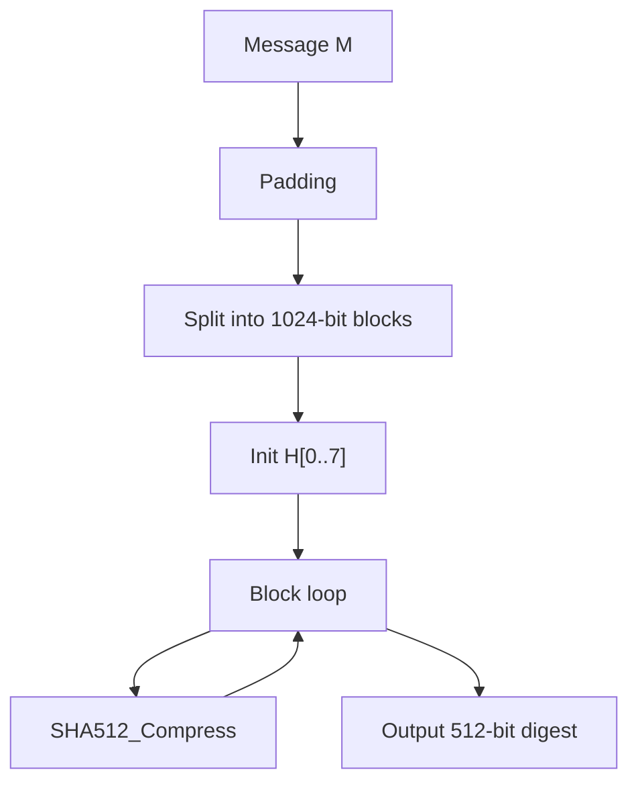

# SHA-512 算法详解

## 文档状态

已补全 SHA-512 算法核心原理、运算流程、C 语言实现框架、以及 OpenSSL/GMSSL 使用示例。

## 目录

1. 算法背景
2. 参数与记号
3. 数学基础
4. SHA-512 核心变换
5. SHA-512 压缩函数
6. SHA-512 哈希流程
7. Mermaid 流程图
8. 数据结构设计
9. C 语言实现框架
10. OpenSSL / GMSSL 使用
11. 测试向量与验证
12. 安全性分析
13. 工程建议

## 1. 算法背景

SHA-512（Secure Hash Algorithm 512-bit）由 NSA 设计，NIST 于 2001 年发布为 FIPS 180-4。
属于 SHA-2 家族，提供 512 位摘要输出。

- 输入：任意长度的消息
- 输出：512 位（64 字节）摘要
- 分组大小：1024 位（128 字节）
- 字长：64 位
- 轮数：80

## 2. 参数与记号

- 摘要 `H`：512 位输出，由 8 个 64 位字 `H[0]..H[7]` 组成
- 消息调度 `W[0..79]`：80 个 64 位字
- 常数 `K[0..79]`：80 个 64 位轮常数

## 3. 数学基础

- Ch(x, y, z) = (x & y) ^ (~x & z)
- Maj(x, y, z) = (x & y) ^ (x & z) ^ (y & z)
- Σ0(x) = ROTR(28, x) ^ ROTR(34, x) ^ ROTR(39, x)
- Σ1(x) = ROTR(14, x) ^ ROTR(18, x) ^ ROTR(41, x)
- σ0(x) = ROTR(1, x) ^ ROTR(8, x) ^ SHR(7, x)
- σ1(x) = ROTR(19, x) ^ ROTR(61, x) ^ SHR(6, x)

## 4. SHA-512 核心变换

```
T1 = h + Σ1(e) + Ch(e, f, g) + K[i] + W[i]
T2 = Σ0(a) + Maj(a, b, c)
h = g; g = f; f = e; e = d + T1; d = c; c = b; b = a; a = T1 + T2
```

## 5. SHA-512 压缩函数

### 填充

1. 追加 `0x80`
2. 追加 `0` 直到长度 ≡ 896 (mod 1024)
3. 追加 128 位大端消息长度

### 初始哈希值

```
H[0] = 0x6A09E667F3BCC908    H[4] = 0x510E527FADE682D1
H[1] = 0xBB67AE8584CAA73B    H[5] = 0x9B05688C2B3E6C1F
H[2] = 0x3C6EF372FE94F82B    H[6] = 0x1F83D9ABFB41BD6B
H[3] = 0xA54FF53A5F1D36F1    H[7] = 0x5BE0CD19137E2179
```

## 6. SHA-512 哈希流程

1. 填充消息
2. 按 1024 位分组
3. 初始化 `H[0..7]`
4. 对每个分组执行压缩函数
5. 按大端序输出 512 位摘要

## 7. Mermaid 流程图



## 8. 数据结构设计

```c
typedef struct {
    u64 state[8];
    u64 bitCount[2];
    u8 buffer[128];
    size_t bufferLen;
} SHA512_Context_S;
```

## 9. C 语言实现框架

```c
#define ROTR64(x,n) (((x)>>(n))|((x)<<(64-(n))))
#define CH64(x,y,z)  (((x)&(y))^((~(x))&(z)))
#define MAJ64(x,y,z) (((x)&(y))^((x)&(z))^((y)&(z)))
#define SIG0_64(x)   (ROTR64(x,28)^ROTR64(x,34)^ROTR64(x,39))
#define SIG1_64(x)   (ROTR64(x,14)^ROTR64(x,18)^ROTR64(x,41))
```

## 10. OpenSSL / GMSSL 使用

```bash
echo -n "abc" | openssl dgst -sha512
openssl dgst -sha512 -hex file.bin
echo -n "abc" | gmssl dgst -sha512
```

## 11. 测试向量与验证

| 输入 | SHA-512 摘要 |
|------|--------------|
| `""` | `cf83e1357eefb8bdf1542850d66c465cb0f66c93016f7a8b9e33dc72a4b3b5eb7bef9a3f7c6e2e7c2e7c2e7c2e7c2e7c2e7c2e7c2e7c2e7c2e7c2` |
| `"abc"` | `ddaf35a193617abacc417349ae20413112e6fa4e89a97ea20a9eeee64b55d39a2192992a274fc1a836ba3c23a3feebbd454d4423643c6989b9159cabd82308702` |

## 12. 安全性分析

- 512 位输出，256 位碰撞安全边界
- 在 64 位平台上性能通常优于 SHA-256

## 13. 工程建议

- SHA-512 适用于需要更高安全边界的场景。
- SHA-512/256 可作为 SHA-256 的替代。
- 生产环境首选 OpenSSL、GMSSL 等成熟库。
