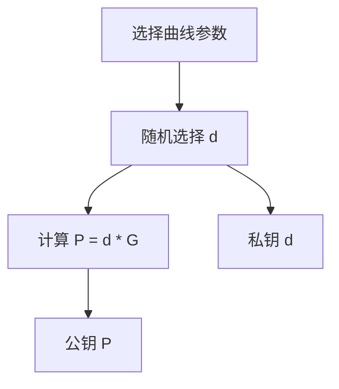
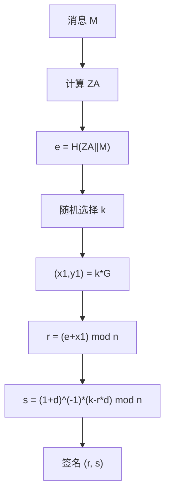
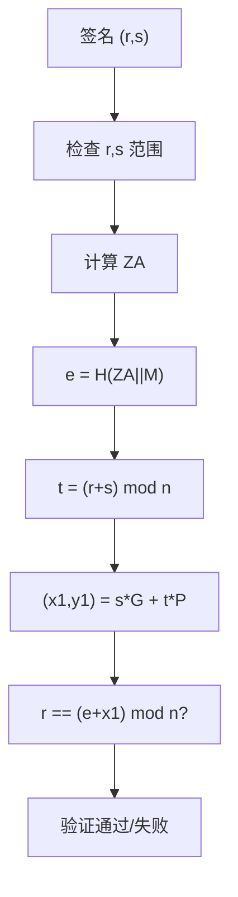
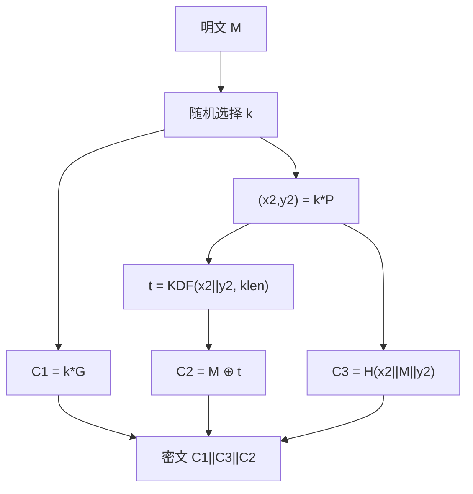
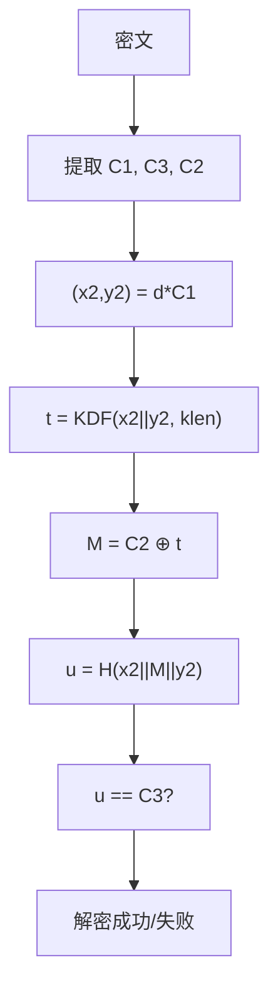
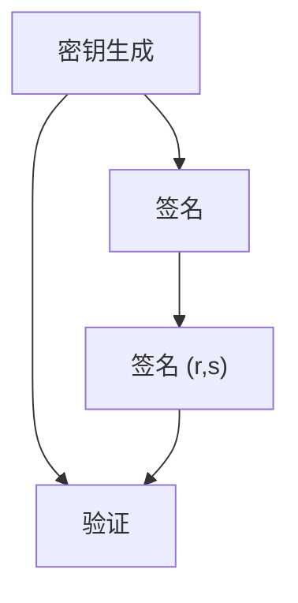
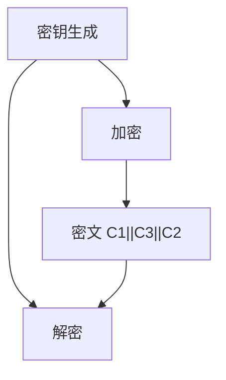

# SM2 算法详解

## 文档状态

已补全 SM2 算法核心原理、密钥生成、签名验证、加密解密、C 语言实现框架、以及 OpenSSL/GMSSL 使用示例。

## 目录

1. 算法背景
2. 参数与记号
3. 数学基础
4. SM2 密钥生成
5. SM2 签名流程
6. SM2 验证流程
7. SM2 加密流程
8. SM2 解密流程
9. Mermaid 流程图
10. 数据结构设计
11. C 语言实现框架
12. SM2 曲线参数
13. OpenSSL / GMSSL 使用
14. 测试向量与验证
15. 安全性分析
16. 工程建议
17. 与 ECDSA/RSA 对比

## 1. 算法背景

SM2 是中国国家密码管理局于 2010 年发布的基于椭圆曲线的公钥密码算法，标准号为 GB/T 32918-2016（原 GM/T 0003-2012）。
SM2 包含数字签名、密钥交换和公钥加密三个部分，使用 256-bit 椭圆曲线。

SM2 广泛应用于：
- 中国金融支付系统
- 电子政务系统
- 身份认证
- SSL/TLS 国密套件

## 2. 参数与记号

- 椭圆曲线 `E`：定义在有限域 `GF(p)` 上，方程 `y^2 = x^3 + ax + b`。
- 基点 `G`：椭圆曲线上的固定点，阶为大素数 `n`。
- 阶 `n`：基点 `G` 的阶。
- 余因子 `h`：`h = #E(GF(p)) / n`。
- 私钥 `d`：随机选择的整数，`1 ≤ d ≤ n-1`。
- 公钥 `P`：椭圆曲线上的点，`P = d * G`。
- 哈希函数 `H`：SM3。
- 用户 ID `IDA`：用户标识，用于计算 Z 值。

## 3. 数学基础

### 3.1 SM2 椭圆曲线

SM2 使用推荐 256-bit 曲线，方程为：

```
y^2 = x^3 + ax + b (mod p)
```

其中：
- `p = 0xFFFFFFFEFFFFFFFFFFFFFFFFFFFFFFFFFFFFFFFF00000000FFFFFFFFFFFFFFFF`
- `a = 0xFFFFFFFEFFFFFFFFFFFFFFFFFFFFFFFFFFFFFFFF00000000FFFFFFFFFFFFFFFC`
- `b = 0x28E9FA9E9D9F5E344D5A9E4BCF6509A7F39789F515AB8F92DDBCBD414D940E93`

### 3.2 点运算

与 ECDSA 相同，SM2 使用椭圆曲线点加法和点乘法。

### 3.3 Z 值计算

SM2 签名和加密中使用 Z 值作为消息前缀：

```
ZA = H(ENTLA || IDA || a || b || xG || yG || xA || yA)
```

其中 `ENTLA` 为 `IDA` 的比特长度（2 字节），`xA` 和 `yA` 为公钥坐标。

### 3.4 KDF 密钥派生函数

SM2 加密使用 KDF 派生密钥：

```
KDF(Z, klen):
    ct = 0x00000001
    for i in 1..ceil(klen/v):
        Ha_i = H(Z || ct)
        ct++
    K = Ha_1 || Ha_2 || ... || Ha_{ceil(klen/v)}
    return K的前 klen 位
```

## 4. SM2 密钥生成

密钥生成步骤：

1. 选择椭圆曲线参数 `(p, a, b, G, n, h)`。
2. 随机选择私钥 `d`，`1 ≤ d ≤ n-1`。
3. 计算公钥 `P = d * G`。

伪码：

```
d = RandomInteger(1, n-1)
P = PointMultiply(d, G)
PrivateKey = d
PublicKey = P
```

### 4.1 SM2 密钥生成流程图



## 5. SM2 签名流程

签名步骤：

1. 计算Z值：`ZA = H(ENTLA || IDA || a || b || xG || yG || xA || yA)`。
2. 计算消息哈希：`e = H(ZA || M)`。
3. 随机选择临时密钥 `k`，`1 ≤ k ≤ n-1`。
4. 计算点 `(x1, y1) = k * G`。
5. 计算 `r = (e + x1) mod n`，若 `r = 0` 或 `r + k = n` 则重新选择 `k`。
6. 计算 `s = ((1 + d)^(-1) * (k - r * d)) mod n`，若 `s = 0` 则重新选择 `k`。
7. 签名为 `(r, s)`。

伪码：

```
ZA = ComputeZA(IDA, a, b, xG, yG, xA, yA)
e = Hash(ZA || M)
k = RandomInteger(1, n-1)
(x1, y1) = PointMultiply(k, G)
r = (e + x1) mod n
s = ModularInverse(1 + d, n) * (k - r * d) mod n
Signature = (r, s)
```

### 5.1 SM2 签名流程图



## 6. SM2 验证流程

验证步骤：

1. 检查 `r` 和 `s` 是否在 `[1, n-1]` 范围内。
2. 计算Z值 `ZA`。
3. 计算消息哈希 `e = H(ZA || M)`。
4. 计算 `t = (r + s) mod n`，若 `t = 0` 则验证失败。
5. 计算点 `(x1, y1) = s * G + t * P`。
6. 验证 `r ≡ (e + x1) mod n`。

伪码：

```
if r < 1 or r >= n or s < 1 or s >= n:
    return INVALID
ZA = ComputeZA(IDA, a, b, xG, yG, xA, yA)
e = Hash(ZA || M)
t = (r + s) mod n
if t == 0:
    return INVALID
(x1, y1) = PointMultiply(s, G) + PointMultiply(t, P)
return r == (e + x1) mod n
```

### 6.1 SM2 验证流程图



## 7. SM2 加密流程

SM2 加密步骤：

1. 计算Z值 `ZA`。
2. 计算消息前缀 `M' = ZA || M`（部分实现中省略此步）。
3. 随机选择临时密钥 `k`，`1 ≤ k ≤ n-1`。
4. 计算点 `C1 = k * G`。
5. 计算点 `(x2, y2) = k * P`。
6. 计算 `t = KDF(x2 || y2, klen)`，若 `t` 全零则重新选择 `k`。
7. 计算 `C2 = M ⊕ t`。
8. 计算 `C3 = H(x2 || M || y2)`。
9. 密文为 `C1 || C3 || C2` 或 `C1 || C2 || C3`（取决于标准版本）。

伪码：

```
k = RandomInteger(1, n-1)
C1 = PointMultiply(k, G)
(x2, y2) = PointMultiply(k, P)
t = KDF(x2 || y2, bitlen(M))
C2 = M XOR t
C3 = Hash(x2 || M || y2)
Ciphertext = C1 || C3 || C2
```

### 7.1 SM2 加密流程图



## 8. SM2 解密流程

SM2 解密步骤：

1. 从密文中提取 `C1`、`C3`、`C2`。
2. 验证 `C1` 是否为曲线上的有效点。
3. 计算点 `(x2, y2) = d * C1`。
4. 计算 `t = KDF(x2 || y2, klen)`。
5. 计算 `M = C2 ⊕ t`。
6. 计算 `u = H(x2 || M || y2)`。
7. 验证 `u == C3`，若不等则解密失败。

伪码：

```
(x2, y2) = PointMultiply(d, C1)
t = KDF(x2 || y2, bitlen(C2))
M = C2 XOR t
u = Hash(x2 || M || y2)
if u != C3:
    return ERROR
return M
```

### 8.1 SM2 解密流程图



## 9. Mermaid 流程图

### 9.1 SM2 签名与验证



### 9.2 SM2 加密与解密



## 10. 数据结构设计

推荐数据结构：

- `u32 privateKey[8]`：256-bit 私钥。
- `u32 publicKeyX[8]`：公钥 X 坐标。
- `u32 publicKeyY[8]`：公钥 Y 坐标。
- `u32 signatureR[8]`：签名 r 分量。
- `u32 signatureS[8]`：签名 s 分量。

接口设计示例：

- `void SM2_GenerateKey(SM2_Context_S* context);`
- `void SM2_Sign(const u8* hash, size_t hashLen, u8* signature, size_t* sigLen, const SM2_Context_S* context);`
- `int SM2_Verify(const u8* hash, size_t hashLen, const u8* signature, size_t sigLen, const SM2_Context_S* context);`
- `void SM2_Encrypt(const u8* plaintext, size_t ptLen, u8* ciphertext, size_t* ctLen, const SM2_Context_S* context);`
- `int SM2_Decrypt(const u8* ciphertext, size_t ctLen, u8* plaintext, size_t* ptLen, const SM2_Context_S* context);`

## 11. C 语言实现框架

示例实现包含 SM2 核心运算（简化版，使用内部大数库）。

```c
#include <stdint.h>
#include <string.h>

typedef uint8_t u8;
typedef uint32_t u32;

#define SM2_WORD_SIZE 8

typedef struct {
    u32 privateKey[SM2_WORD_SIZE];
    u32 publicKeyX[SM2_WORD_SIZE];
    u32 publicKeyY[SM2_WORD_SIZE];
} SM2_Context_S;

typedef struct {
    u32 r[SM2_WORD_SIZE];
    u32 s[SM2_WORD_SIZE];
} SM2_Signature_S;

void SM2_GenerateKey(SM2_Context_S* context)
{
    (void)context;
}

void SM2_Sign(const u8* hash, size_t hashLen, SM2_Signature_S* sig, const SM2_Context_S* context)
{
    (void)hash;
    (void)hashLen;
    (void)sig;
    (void)context;
}

int SM2_Verify(const u8* hash, size_t hashLen, const SM2_Signature_S* sig, const SM2_Context_S* context)
{
    (void)hash;
    (void)hashLen;
    (void)sig;
    (void)context;
    return 0;
}

void SM2_Encrypt(const u8* plaintext, size_t ptLen, u8* ciphertext, size_t* ctLen, const SM2_Context_S* context)
{
    (void)plaintext;
    (void)ptLen;
    (void)ciphertext;
    (void)ctLen;
    (void)context;
}

int SM2_Decrypt(const u8* ciphertext, size_t ctLen, u8* plaintext, size_t* ptLen, const SM2_Context_S* context)
{
    (void)ciphertext;
    (void)ctLen;
    (void)plaintext;
    (void)ptLen;
    (void)context;
    return 0;
}
```

以上为 SM2 算法框架实现。完整实现需要大整数运算库和椭圆曲线点运算库支持，生产环境推荐使用 GMSSL 等成熟库。

## 12. SM2 曲线参数

### 12.1 推荐 256-bit 曲线

- 素数 `p = 0xFFFFFFFEFFFFFFFFFFFFFFFFFFFFFFFFFFFFFFFF00000000FFFFFFFFFFFFFFFF`
- 参数 `a = 0xFFFFFFFEFFFFFFFFFFFFFFFFFFFFFFFFFFFFFFFF00000000FFFFFFFFFFFFFFFC`
- 参数 `b = 0x28E9FA9E9D9F5E344D5A9E4BCF6509A7F39789F515AB8F92DDBCBD414D940E93`
- 基点 `G` 的 X 坐标 `Gx = 0x32C4AE2C1F1981195F9904466A39C9948FE30BBFF2660BE1715A4589334C74C7`
- 基点 `G` 的 Y 坐标 `Gy = 0xBC3736A2F4F6779C59BDCEE36B692153D0A9877CC62A474002DF32E52139F0A0`
- 阶 `n = 0xFFFFFFFEFFFFFFFFFFFFFFFFFFFFFFFF7203DF6B21C6052B53BBF40939D54123`
- 余因子 `h = 1`

## 13. OpenSSL / GMSSL 使用

### GMSSL SM2 密钥生成

```bash
gmssl sm2 -genkey -out sm2_private.pem
gmssl sm2 -in sm2_private.pem -pubout -out sm2_public.pem
```

### GMSSL SM2 签名

```bash
gmssl sm2 -sign -in sm2_private.pem -in message.txt -out signature.bin
```

### GMSSL SM2 验证

```bash
gmssl sm2 -verify -in sm2_public.pem -in message.txt -signature signature.bin
```

### GMSSL SM2 加密

```bash
gmssl sm2 -encrypt -in sm2_public.pem -in plain.txt -out cipher.bin
```

### GMSSL SM2 解密

```bash
gmssl sm2 -decrypt -in sm2_private.pem -in cipher.bin -out plain_out.txt
```

### OpenSSL 3.0+ SM2 支持

OpenSSL 3.0 及以上版本支持 SM2：

```bash
openssl genpkey -algorithm SM2 -out sm2_private.pem
openssl pkey -in sm2_private.pem -pubout -out sm2_public.pem
```

## 14. 测试向量与验证

### SM2 签名测试向量

GB/T 32918-2016 中的测试向量：

- 用户 ID：`31323334353637383132333435363738`（"1234567812345678"）
- 私钥 `d` 和消息 `M` 为已知值
- 签名 `(r, s)` 为预期输出

### SM2 加密测试向量

- 明文：`6D65737361676520646967657374`（"message digest"）
- 密文包含 `C1 || C3 || C2` 三部分

### 验证方式

1. 生成 SM2 密钥对。
2. 使用私钥对消息签名，验证签名格式。
3. 使用公钥验证签名，确认验证通过。
4. 使用公钥加密明文，使用私钥解密，验证还原。
5. 篡改密文后解密应失败。

## 15. 安全性分析

SM2 的安全性基于椭圆曲线离散对数问题 (ECDLP) 的困难性。

- 256-bit SM2 提供约 128-bit 安全级别。
- 临时密钥 `k` 必须使用密码学安全随机数生成器。
- Z 值机制防止某些攻击（如选择消息攻击）。
- C3 校验机制保证加密完整性。

### 15.1 安全优势

- Z 值机制将用户标识与签名绑定。
- 加密方案内置完整性校验（C3）。
- 使用 SM3 哈希函数，与国密体系一致。

### 15.2 已知风险

- 临时密钥 `k` 的重用或泄露将导致私钥泄露。
- 侧信道攻击需要恒定时间实现。
- 加密密文的 C1 部分需要验证是否为有效曲线点。

## 16. 工程建议

- 生产环境首选成熟库实现，如 GMSSL、OpenSSL 3.0+。
- 临时密钥 `k` 推荐使用确定性生成方法。
- 实现应使用恒定时间算法，防止侧信道攻击。
- 加密时必须验证 C1 为有效曲线点。
- 解密时必须验证 C3 校验值。
- 私钥必须安全存储，推荐使用 HSM 或密钥管理服务。

## 17. 与 ECDSA/RSA 对比

| 特性 | SM2 | ECDSA P-256 | RSA-2048 |
|------|-----|-------------|----------|
| 算法类型 | 椭圆曲线 | 椭圆曲线 | 整数分解 |
| 密钥长度 | 256 bit | 256 bit | 2048 bit |
| 签名长度 | 64 字节 | 64 字节 | 256 字节 |
| 安全级别 | 128 bit | 128 bit | 112 bit |
| 加密支持 | 是 | 否（需 ECIES） | 是 |
| 哈希函数 | SM3 | SHA-256 | 任意 |
| 标准化 | GB/T 32918 | FIPS 186-4 | PKCS#1 |
| Z 值机制 | 是 | 否 | 否 |

SM2 相比 ECDSA 增加了 Z 值机制和加密功能，相比 RSA 在密钥长度和签名长度上有显著优势。
