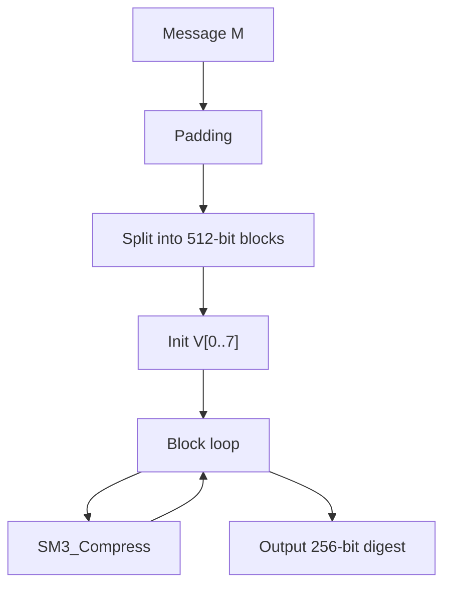

# SM3 算法详解

## 文档状态

已补全 SM3 算法核心原理、运算流程、C 语言实现框架、以及 OpenSSL/GMSSL 使用示例。

## 目录

1. 算法背景
2. 参数与记号
3. 数学基础
4. SM3 核心变换
5. SM3 压缩函数
6. SM3 哈希流程
7. Mermaid 流程图
8. 数据结构设计
9. C 语言实现框架
10. OpenSSL / GMSSL 使用
11. 测试向量与验证
12. 安全性分析
13. 工程建议

## 1. 算法背景

SM3 是中国国家密码管理局于 2010 年发布的密码散列算法标准，标准号为 GB/T 32905-2016。

- 输入：任意长度的消息
- 输出：256 位（32 字节）摘要
- 分组大小：512 位（64 字节）
- 字长：32 位
- 轮数：64

## 2. 参数与记号

- 摘要 `V`：256 位输出，由 8 个 32 位字 `V[0]..V[7]` 组成
- 消息字 `W[0..67]` 和 `W'[0..63]`
- 常数 `T[j]`：`j < 16` 时为 `0x79CC4519`，`j >= 16` 时为 `0x7A879D8A`

## 3. 数学基础

- P0(X) = X ^ ROTL(9, X) ^ ROTL(17, X)
- P1(X) = X ^ ROTL(15, X) ^ ROTL(23, X)
- FF_j(X,Y,Z)：j<16 时 X^Y^Z，否则 (X&Y)|(X&Z)|(Y&Z)
- GG_j(X,Y,Z)：j<16 时 X^Y^Z，否则 (X&Y)|(~X&Z)

## 4. SM3 核心变换

### 消息扩展

```
W[i] = P1(W[i-16]^W[i-9]^ROTL(15,W[i-3])) ^ ROTL(7,W[i-13]) ^ W[i-6]  (16<=i<=67)
W'[i] = W[i] ^ W[i+4]  (0<=i<=63)
```

### 压缩函数

```
SS1 = ROTL(7, (ROTL(12,A)+E+ROTL(j,T[j])) mod 2^32)
SS2 = SS1 ^ ROTL(12,A)
TT1 = FF_j(A,B,C) + D + SS2 + W'[j]
TT2 = GG_j(E,F,G) + H + SS1 + W[j]
D=C; C=ROTL(9,B); B=A; A=TT1
H=G; G=ROTL(19,F); F=E; E=P0(TT2)
```

## 5. SM3 压缩函数

### 填充

与 SHA-256 相同：追加 `0x80`，补零至长度 ≡ 448 (mod 512)，追加 64 位大端长度。

### 初始值

```
V[0] = 0x7380166F    V[4] = 0xA96F30BC
V[1] = 0x4914B2B9    V[5] = 0x163138AA
V[2] = 0x172442D7    V[6] = 0xE38DEE4D
V[3] = 0xDA8A0600    V[7] = 0xB0FB0E4E
```

## 6. SM3 哈希流程

1. 填充消息
2. 按 512 位分组
3. 初始化 `V[0..7]`
4. 对每个分组执行压缩函数：`V[i+1] = CF(V[i], B[i])`
5. 按大端序输出 256 位摘要

## 7. Mermaid 流程图



## 8. 数据结构设计

```c
typedef struct {
    u32 state[8];
    u64 bitCount;
    u8 buffer[64];
    size_t bufferLen;
} SM3_Context_S;
```

## 9. C 语言实现框架

```c
#define ROTL(x,n) (((x)<<(n))|((x)>>(32-(n))))
#define P0(x) ((x) ^ ROTL((x),9) ^ ROTL((x),17))
#define P1(x) ((x) ^ ROTL((x),15) ^ ROTL((x),23))
```

## 10. OpenSSL / GMSSL 使用

```bash
echo -n "abc" | gmssl dgst -sm3
echo -n "abc" | openssl dgst -sm3
```

## 11. 测试向量与验证

| 输入 | SM3 摘要 |
|------|----------|
| `""` | `1ab21d8355cfa17f8e61194831e81a8f40a064289e06951fd5fa28824b1d367b` |
| `"abc"` | `66c7f0f46186f806142bd10df7416b39ffb1be851efd5c0fc79e88c514b51bfb` |

## 12. 安全性分析

- 256 位输出，128 位碰撞安全边界
- 已纳入 ISO/IEC 10118-3 国际标准

## 13. 工程建议

- SM3 是中国密码标准体系中的推荐散列算法。
- 生产环境首选 GMSSL、OpenSSL 1.1.1+。
- SM3 常与 SM2、SM4 配合使用。
