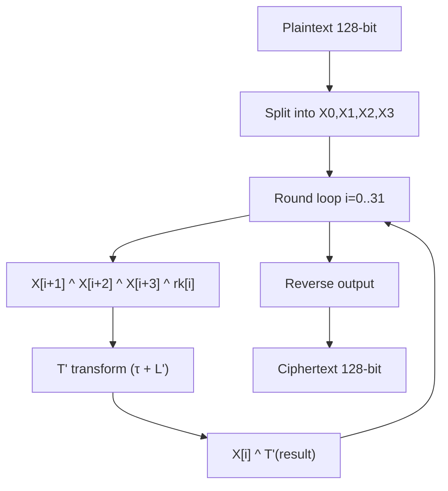
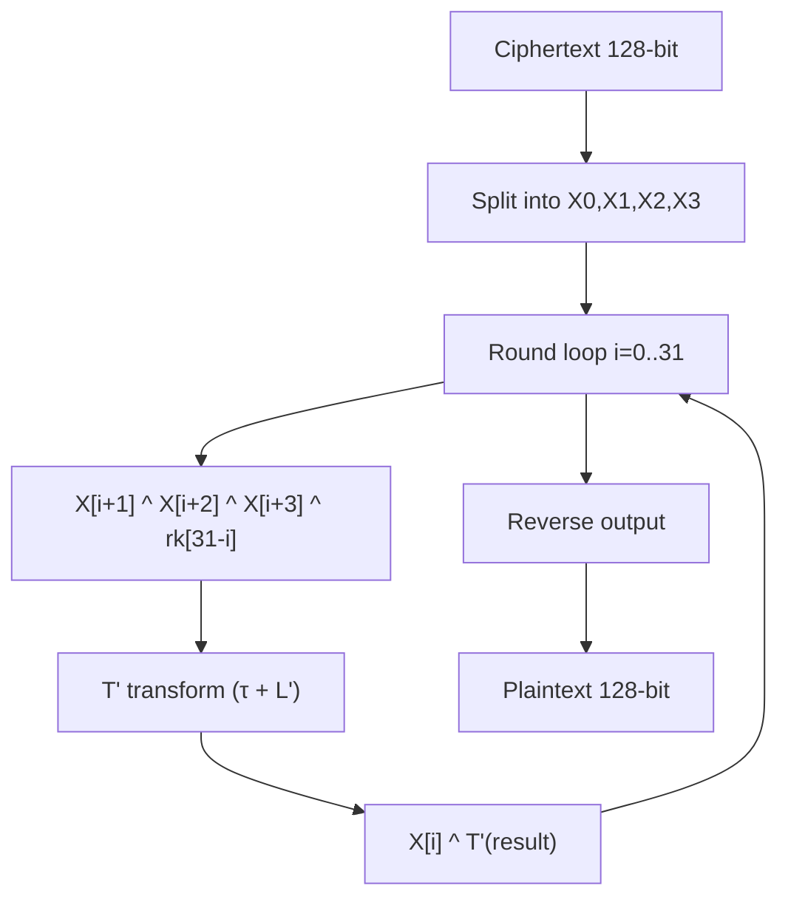
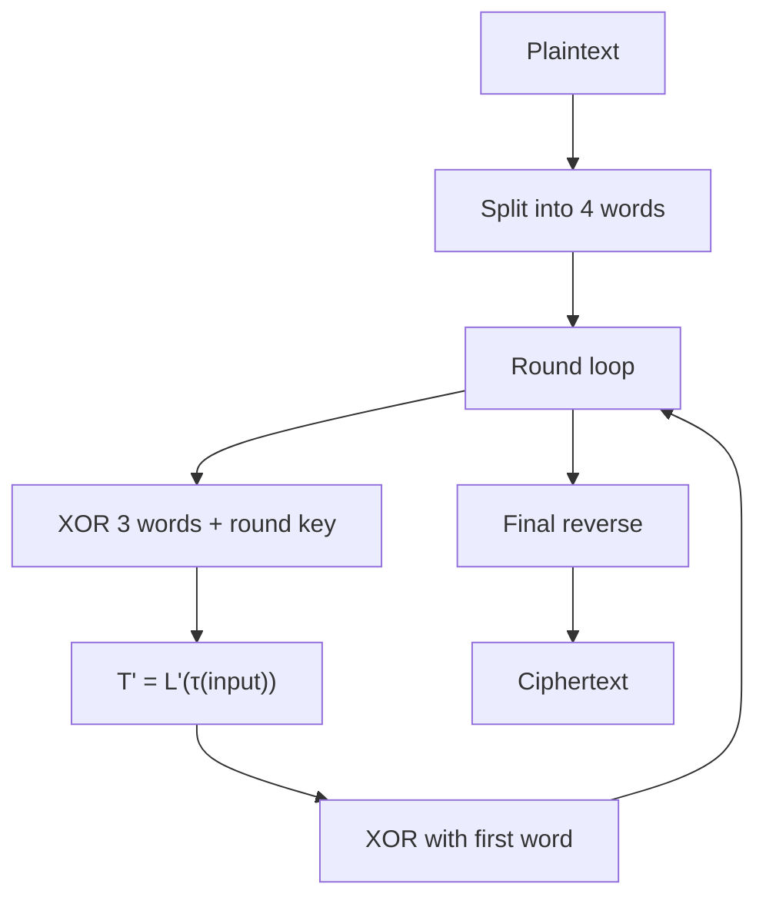
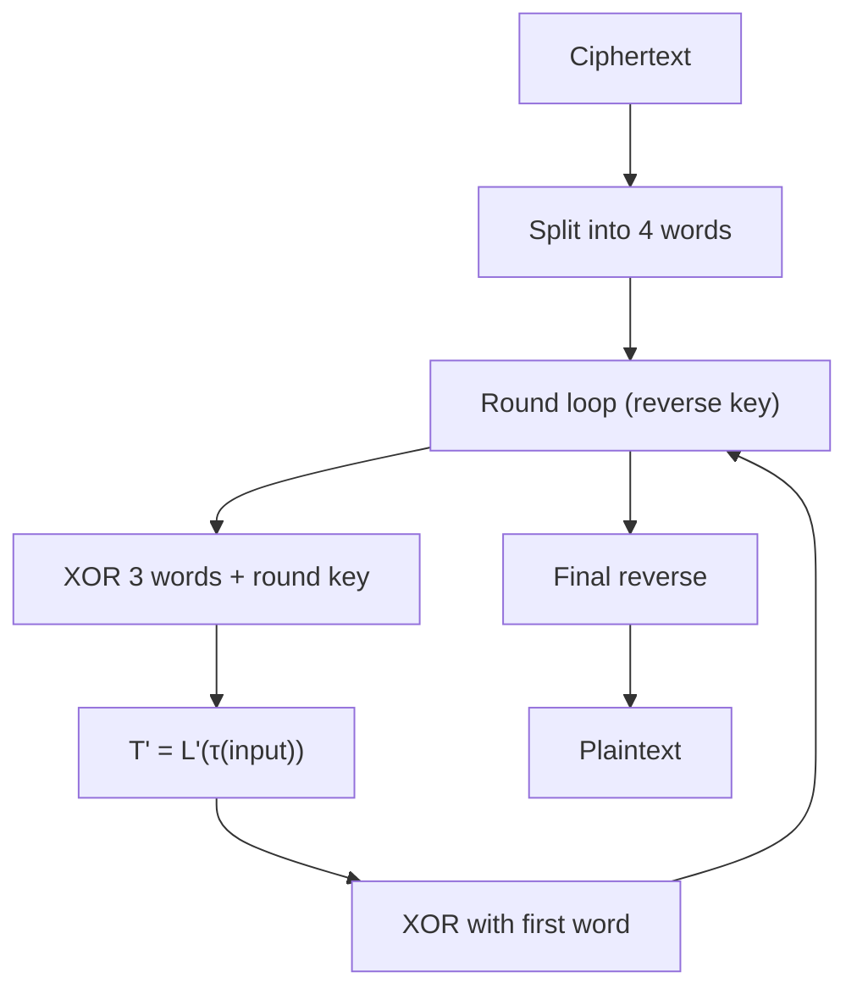
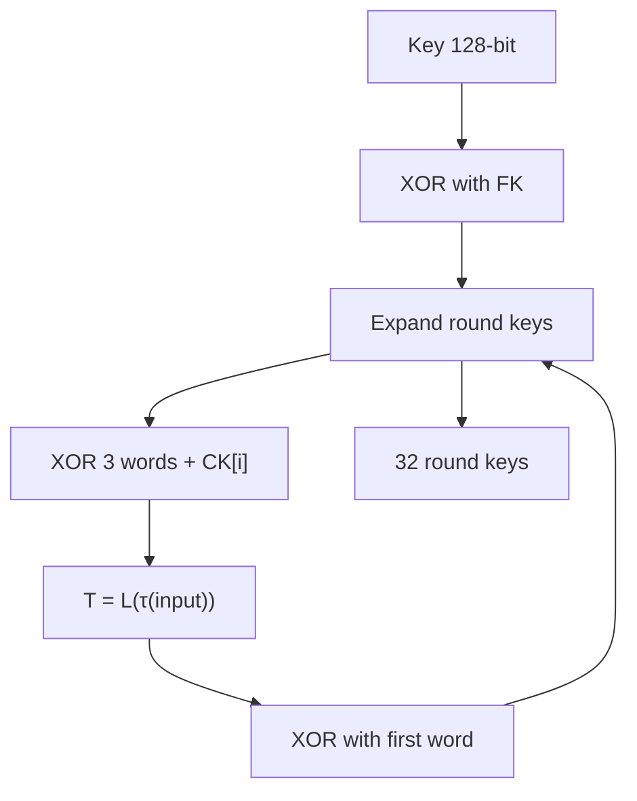

# SM4 算法详解

## 文档状态

已补全 SM4 算法核心原理、运算流程、密钥扩展、C 语言实现框架、以及 OpenSSL/GMSSL 使用示例。

## 目录

1. 算法背景
2. 参数与记号
3. 数学基础
4. SM4 核心变换
5. 密钥扩展 (Key Schedule)
6. SM4 加密流程
7. SM4 解密流程
8. Mermaid 流程图
9. 数据结构设计
10. C 语言实现框架
11. 常见分组模式与填充
12. OpenSSL / GMSSL 使用
13. 测试向量与验证
14. 安全性分析
15. 工程建议

## 1. 算法背景

SM4 是中国国家密码管理局于 2012 年发布的分组密码算法，标准号为 GB/T 32907-2016（原 GM/T 0002-2012）。
SM4 采用分组密码结构，对固定 128 位分组进行加密，密钥长度固定为 128 位，共 32 轮迭代。

SM4 最初作为无线局域网 WAPI 协议的加密算法，现已广泛应用于中国金融、政务、物联网等领域。

## 2. 参数与记号

- 明文块 `P`：128 位，分为 4 个 32-bit 字 `(X0, X1, X2, X3)`。
- 密钥 `K`：128 位，分为 4 个 32-bit 字 `(MK0, MK1, MK2, MK3)`。
- 轮密钥 `rk[i]`：32-bit，共 32 个。
- 轮数：32 轮。
- 系统参数 `FK[j]`：4 个 32-bit 常数。
- 固定参数 `CK[j]`：32 个 32-bit 常数。

## 3. 数学基础

SM4 的核心运算基于 32-bit 字的循环移位与异或操作。

### 3.1 S-Box

SM4 使用固定 8x8 S-Box 作为非线性替代。S-Box 的构造基于仿射变换与乘法逆元的复合运算。

S-Box 的具体映射如下（前 16 个值示例）：

```
0x00 -> 0xD6, 0x01 -> 0x90, 0x02 -> 0xE9, 0x03 -> 0xFE
0x04 -> 0xCC, 0x05 -> 0xE1, 0x06 -> 0x3D, 0x07 -> 0xB7
...
```

### 3.2 非线性变换 τ

对 32-bit 输入 `A`，按字节应用 S-Box 替代：

```
τ(A) = (SBox(a0), SBox(a1), SBox(a2), SBox(a3))
```

其中 `A = (a0, a1, a2, a3)`，每个 `ai` 为 8-bit 字节。

### 3.3 线性变换 L 和 L'

**密钥扩展用线性变换 L：**

```
L(B) = B ⊕ (B<<<2) ⊕ (B<<<10) ⊕ (B<<<18) ⊕ (B<<<24)
```

**加密/解密用线性变换 L'：**

```
L'(B) = B ⊕ (B<<<13) ⊕ (B<<<23)
```

其中 `<<<k` 表示 32-bit 循环左移 k 位。

### 3.4 合成变换 T 和 T'

**密钥扩展用 T：**

```
T(A) = L(τ(A))
```

**加密/解密用 T'：**

```
T'(A) = L'(τ(A))
```

## 4. SM4 核心变换

每轮加密包含以下操作：

1. 对输入字 `(Xi, Xi+1, Xi+2, Xi+3)` 执行轮函数 `F`。
2. 轮函数 `F(Xi+1, Xi+2, Xi+3, rki) = Xi ⊕ T'(Xi+1 ⊕ Xi+2 ⊕ Xi+3 ⊕ rki)`。
3. 将结果作为 `Xi+4`，移位寄存器向前推进。

## 5. 密钥扩展 (Key Schedule)

密钥扩展将 128-bit 密钥扩展为 32 个轮密钥。

伪码：

```
(K0, K1, K2, K3) = (MK0 ⊕ FK0, MK1 ⊕ FK1, MK2 ⊕ FK2, MK3 ⊕ FK3)
for i in 0..31:
    rki = Ki ⊕ T(Ki+1 ⊕ Ki+2 ⊕ Ki+3 ⊕ CK[i])
    Ki+4 = rki
```

其中：

- `FK = (0xA3B1BAC6, 0x56AA3350, 0x677D9197, 0xB27022DC)`
- `CK[i]` 的每个字节由 `(4i+j)*7 mod 256` 生成，共 32 个常数。

## 6. SM4 加密流程

SM4 加密总流程：

1. 将 128-bit 明文分为 4 个 32-bit 字 `(X0, X1, X2, X3)`。
2. 对 `i = 0..31` 执行 32 轮迭代：
   - `Xi+4 = F(Xi, Xi+1, Xi+2, Xi+3, rki) = Xi ⊕ T'(Xi+1 ⊕ Xi+2 ⊕ Xi+3 ⊕ rki)`
3. 逆序输出：`(Y0, Y1, Y2, Y3) = (X35, X34, X33, X32)`

伪码：

```
(X0, X1, X2, X3) = Plaintext
for i in 0..31:
    X[i+4] = X[i] ^ T'(X[i+1] ^ X[i+2] ^ X[i+3] ^ rk[i])
Ciphertext = (X[35], X[34], X[33], X[32])
```

### 6.1 SM4 加密流程图



## 7. SM4 解密流程

SM4 解密与加密流程相同，仅轮密钥使用顺序相反（从 `rk[31]` 到 `rk[0]`）。

伪码：

```
(X0, X1, X2, X3) = Ciphertext
for i in 0..31:
    X[i+4] = X[i] ^ T'(X[i+1] ^ X[i+2] ^ X[i+3] ^ rk[31-i])
Plaintext = (X[35], X[34], X[33], X[32])
```

### 7.1 SM4 解密流程图



## 8. Mermaid 流程图

### 8.1 SM4 加密流程



### 8.2 SM4 解密流程



### 8.3 SM4 密钥扩展流程



## 9. 数据结构设计

推荐数据结构：

- `uint8_t state[16]`：128-bit 状态块。
- `uint32_t roundKey[32]`：32 个轮密钥。
- `uint8_t key[16]`：128-bit 密钥。

接口设计示例：

- `void SM4_KeyExpansion(const uint8_t key[16], SM4_Context_S* context);`
- `void SM4_EncryptBlock(const uint8_t plaintext[16], uint8_t ciphertext[16], const SM4_Context_S* context);`
- `void SM4_DecryptBlock(const uint8_t ciphertext[16], uint8_t plaintext[16], const SM4_Context_S* context);`
- `void SM4_Encrypt(const uint8_t key[16], const uint8_t plaintext[16], uint8_t ciphertext[16]);`
- `void SM4_Decrypt(const uint8_t key[16], const uint8_t ciphertext[16], uint8_t plaintext[16]);`

## 10. C 语言实现框架

示例实现包含完整 SM4 密钥扩展与加解密操作。

```c
#include <stdint.h>
#include <string.h>

typedef uint8_t u8;
typedef uint32_t u32;

static const u8 g_sm4SBox[256] = {
    0xd6, 0x90, 0xe9, 0xfe, 0xcc, 0xe1, 0x3d, 0xb7, 0x16, 0xb6, 0x14, 0xc2, 0x28, 0xfb, 0x2c, 0x05,
    0x2b, 0x67, 0x9a, 0x76, 0x2a, 0xbe, 0x04, 0xc3, 0xaa, 0x44, 0x13, 0x26, 0x49, 0x86, 0x06, 0x99,
    0x9c, 0x42, 0x50, 0xf4, 0x91, 0xef, 0x98, 0x7a, 0x33, 0x54, 0x0b, 0x43, 0x06, 0x45, 0x61, 0x53,
    0x7a, 0x23, 0x7d, 0xfd, 0xcc, 0x39, 0xdc, 0x63, 0x96, 0x16, 0xcf, 0x0d, 0x13, 0xe0, 0x72, 0xa1,
    0x69, 0x1c, 0xe7, 0x41, 0x89, 0x94, 0x37, 0x2d, 0xc1, 0x5c, 0x76, 0x00, 0x7b, 0x72, 0x95, 0x64,
    0xc4, 0x7d, 0x32, 0x17, 0x0d, 0xf2, 0x88, 0xf3, 0x0e, 0x8f, 0xad, 0x6c, 0x4b, 0x1f, 0xe6, 0x9e,
    0xf8, 0x65, 0xf0, 0xfe, 0x17, 0x98, 0x11, 0x69, 0xd9, 0x8e, 0x94, 0x9b, 0x1e, 0x87, 0xe9, 0xce,
    0x55, 0x28, 0xdf, 0x8c, 0xa1, 0x89, 0x0d, 0xbf, 0xe6, 0x42, 0x68, 0x41, 0x99, 0x2d, 0x0f, 0xb0,
    0x54, 0xbb, 0x16, 0x4d, 0x09, 0xa1, 0x6c, 0xc1, 0x1d, 0x8a, 0x63, 0xc7, 0xf0, 0x02, 0x74, 0xee,
    0xb3, 0x13, 0xf0, 0x25, 0x69, 0x15, 0x34, 0x04, 0xe6, 0x79, 0x8d, 0x24, 0x51, 0x4e, 0x23, 0x35,
    0xff, 0x42, 0x27, 0x39, 0xc2, 0x0d, 0x3d, 0x8d, 0x07, 0x47, 0x16, 0xb3, 0x68, 0x0a, 0x9e, 0xd1,
    0xf7, 0x2c, 0x8c, 0x3d, 0x8d, 0xd4, 0xcf, 0x92, 0x75, 0xf5, 0x7f, 0x70, 0xc9, 0xed, 0x81, 0xde,
    0x47, 0xfe, 0x6e, 0x97, 0x17, 0x05, 0xee, 0xf7, 0x5b, 0x56, 0x8d, 0x77, 0x0d, 0x87, 0x68, 0x95,
    0x02, 0x69, 0x0a, 0x9c, 0x18, 0xa2, 0x74, 0xc7, 0xcc, 0xe9, 0x9a, 0x00, 0x6a, 0x6e, 0xf3, 0xf6,
    0x0f, 0xef, 0xf8, 0xfb, 0xd6, 0x90, 0x4a, 0x1c, 0x60, 0x34, 0xe7, 0x1e, 0x8c, 0xdc, 0x5d, 0x4c,
    0xea, 0xb7, 0x95, 0x18, 0x1a, 0xc7, 0x42, 0x3b, 0x01, 0x9e, 0xa3, 0xe8, 0x13, 0x3c, 0x0c, 0x40
};

static const u32 g_sm4FK[4] = {
    0xA3B1BAC6UL, 0x56AA3350UL, 0x677D9197UL, 0xB27022DCUL
};

static const u32 g_sm4CK[32] = {
    0x00070E15UL, 0x1C232A31UL, 0x383F464DUL, 0x545B6269UL,
    0x70777E85UL, 0x8C939AA1UL, 0xA8AFB6BDUL, 0xC4CBD2D9UL,
    0xE0E7EEF5UL, 0xFC030A11UL, 0x181F262DUL, 0x343B4249UL,
    0x50575E65UL, 0x6C737A81UL, 0x888F9699UL, 0xA0A7AEB5UL,
    0xBCC3CAD1UL, 0xD8DFE6EDUL, 0xF4FB0209UL, 0x10171E25UL,
    0x2C333A41UL, 0x484F565DUL, 0x646B7279UL, 0x80878E95UL,
    0x9CA3AAB1UL, 0xB8BFC6CDUL, 0xD4DBE2E9UL, 0xF0F7FE05UL,
    0x0C131A21UL, 0x282F3639UL, 0x40475057UL, 0x585F666DUL
};

static inline u8 SM4_SBoxSubstitute(u8 inputValue)
{
    return g_sm4SBox[inputValue];
}

static inline u32 SM4_LinearTransformL_KeySchedule(u32 value)
{
    return value ^ ((value << 13) | (value >> 19)) ^ ((value << 23) | (value >> 9));
}

static inline u32 SM4_LinearTransformL_CipherRound(u32 value)
{
    return value ^ ((value << 2) | (value >> 30)) ^ ((value << 10) | (value >> 22)) ^
           ((value << 18) | (value >> 14)) ^ ((value << 24) | (value >> 8));
}

static inline u32 SM4_NonLinearTransformT_KeySchedule(u32 value)
{
    u32 result = 0;
    result |= ((u32)SM4_SBoxSubstitute((u8)((value >> 24) & 0xFF))) << 24;
    result |= ((u32)SM4_SBoxSubstitute((u8)((value >> 16) & 0xFF))) << 16;
    result |= ((u32)SM4_SBoxSubstitute((u8)((value >> 8) & 0xFF))) << 8;
    result |= ((u32)SM4_SBoxSubstitute((u8)(value & 0xFF)));
    return SM4_LinearTransformL_KeySchedule(result);
}

static inline u32 SM4_NonLinearTransformT_CipherRound(u32 value)
{
    u32 result = 0;
    result |= ((u32)SM4_SBoxSubstitute((u8)((value >> 24) & 0xFF))) << 24;
    result |= ((u32)SM4_SBoxSubstitute((u8)((value >> 16) & 0xFF))) << 16;
    result |= ((u32)SM4_SBoxSubstitute((u8)((value >> 8) & 0xFF))) << 8;
    result |= ((u32)SM4_SBoxSubstitute((u8)(value & 0xFF)));
    return SM4_LinearTransformL_CipherRound(result);
}

static inline u32 SM4_BytesToWord(const u8 data[4])
{
    return (((u32)data[0]) << 24) | (((u32)data[1]) << 16) |
           (((u32)data[2]) << 8) | ((u32)data[3]);
}

static inline void SM4_WordToBytes(u8 data[4], u32 value)
{
    data[0] = (u8)((value >> 24) & 0xFF);
    data[1] = (u8)((value >> 16) & 0xFF);
    data[2] = (u8)((value >> 8) & 0xFF);
    data[3] = (u8)(value & 0xFF);
}

typedef struct {
    u32 roundKey[32];
} SM4_Context_S;

void SM4_KeyExpansion(const u8 key[16], SM4_Context_S* context)
{
    u32 keyWords[4];
    for (int i = 0; i < 4; ++i) {
        keyWords[i] = SM4_BytesToWord(&key[i * 4]);
    }

    u32 workingValue[4];
    for (int i = 0; i < 4; ++i) {
        workingValue[i] = keyWords[i] ^ g_sm4FK[i];
    }

    for (int roundIdx = 0; roundIdx < 32; ++roundIdx) {
        u32 temp = workingValue[1] ^ workingValue[2] ^ workingValue[3] ^ g_sm4CK[roundIdx];
        workingValue[0] ^= SM4_NonLinearTransformT_KeySchedule(temp);
        context->roundKey[roundIdx] = workingValue[0];

        u32 rotateTemp = workingValue[0];
        workingValue[0] = workingValue[1];
        workingValue[1] = workingValue[2];
        workingValue[2] = workingValue[3];
        workingValue[3] = rotateTemp;
    }
}

void SM4_EncryptBlock(const u8 plaintext[16], u8 ciphertext[16], const SM4_Context_S* context)
{
    u32 stateWords[4];
    for (int i = 0; i < 4; ++i) {
        stateWords[i] = SM4_BytesToWord(&plaintext[i * 4]);
    }

    for (int round = 0; round < 32; ++round) {
        u32 temp = stateWords[1] ^ stateWords[2] ^ stateWords[3] ^ context->roundKey[round];
        stateWords[0] ^= SM4_NonLinearTransformT_CipherRound(temp);

        u32 rotateTemp = stateWords[0];
        stateWords[0] = stateWords[1];
        stateWords[1] = stateWords[2];
        stateWords[2] = stateWords[3];
        stateWords[3] = rotateTemp;
    }

    SM4_WordToBytes(&ciphertext[0], stateWords[3]);
    SM4_WordToBytes(&ciphertext[4], stateWords[2]);
    SM4_WordToBytes(&ciphertext[8], stateWords[1]);
    SM4_WordToBytes(&ciphertext[12], stateWords[0]);
}

void SM4_DecryptBlock(const u8 ciphertext[16], u8 plaintext[16], const SM4_Context_S* context)
{
    u32 stateWords[4];
    for (int i = 0; i < 4; ++i) {
        stateWords[i] = SM4_BytesToWord(&ciphertext[i * 4]);
    }

    for (int round = 31; round >= 0; --round) {
        u32 temp = stateWords[1] ^ stateWords[2] ^ stateWords[3] ^ context->roundKey[round];
        stateWords[0] ^= SM4_NonLinearTransformT_CipherRound(temp);

        u32 rotateTemp = stateWords[0];
        stateWords[0] = stateWords[1];
        stateWords[1] = stateWords[2];
        stateWords[2] = stateWords[3];
        stateWords[3] = rotateTemp;
    }

    SM4_WordToBytes(&plaintext[0], stateWords[3]);
    SM4_WordToBytes(&plaintext[4], stateWords[2]);
    SM4_WordToBytes(&plaintext[8], stateWords[1]);
    SM4_WordToBytes(&plaintext[12], stateWords[0]);
}

void SM4_Encrypt(const u8 key[16], const u8 plaintext[16], u8 ciphertext[16])
{
    SM4_Context_S context;
    SM4_KeyExpansion(key, &context);
    SM4_EncryptBlock(plaintext, ciphertext, &context);
}

void SM4_Decrypt(const u8 key[16], const u8 ciphertext[16], u8 plaintext[16])
{
    SM4_Context_S context;
    SM4_KeyExpansion(key, &context);
    SM4_DecryptBlock(ciphertext, plaintext, &context);
}
```

以上实现完整支持 SM4 的密钥扩展与加解密操作。调用 `SM4_KeyExpansion` 生成轮密钥后，使用 `SM4_EncryptBlock` / `SM4_DecryptBlock` 进行加解密，或使用 `SM4_Encrypt` / `SM4_Decrypt` 一步完成。

## 11. 常见分组模式与填充

SM4 本身是一个块加密算法，实际应用时通常配合分组模式与填充：

- ECB: 电子密码本模式，简单但不安全，容易泄露重复块结构。
- CBC: 密文分组链接模式，需要随机 `IV`，适合大多数传统场景。
- CTR: 计数器模式，将块密码转换为流密码，支持并行处理。
- GCM: 认证加密模式，提供保密性与完整性保证。

常见填充方式：

- PKCS#7
- ANSI X.923
- ISO/IEC 7816-4

### CBC 模式

1. 选择 128 位随机 `IV`。
2. 对原文进行 PKCS#7 填充，使长度为 16 的倍数。
3. 逐块加密，并将 `IV` 与密文一起传输。

CBC 过程中：

- 加密：`C_i = E_K(P_i ⊕ C_{i-1})`
- 解密：`P_i = D_K(C_i) ⊕ C_{i-1}`
- 初始块：`C_0 = IV`

### CTR 模式

CTR 将 SM4 转换为流密码：

- 生成计数器块 `CTR_i = Nonce || Counter`
- 计算 `S_i = E_K(CTR_i)`
- 产生 `C_i = P_i ⊕ S_i`

### 填充与边界

- 如果使用 CBC、ECB 等块模式，则必须对明文按 16 字节对齐。
- PKCS#7 填充在解密后必须严格验证，不允许直接丢弃不合法的填充。
- CTR/GCM 不需要块对齐，但不能重复计数器块。

## 12. OpenSSL / GMSSL 使用

### GMSSL SM4-ECB 加密

```bash
gmssl enc -sm4-ecb -K 0123456789abcdeffedcba9876543210 -in plain.bin -out cipher.bin
```

### GMSSL SM4-ECB 解密

```bash
gmssl enc -d -sm4-ecb -K 0123456789abcdeffedcba9876543210 -in cipher.bin -out plain_out.bin
```

### GMSSL SM4-CBC 加密

```bash
gmssl enc -sm4-cbc -K 0123456789abcdeffedcba9876543210 -iv 0123456789abcdeffedcba9876543210 -in plain.bin -out cipher.bin
```

### OpenSSL SM4 支持

OpenSSL 1.1.1 及以上版本支持 SM4：

```bash
openssl enc -sm4-ecb -K 0123456789abcdeffedcba9876543210 -in plain.bin -out cipher.bin
```

## 13. 测试向量与验证

### SM4 标准测试向量

GB/T 32907-2016 中的标准测试向量：

- 密钥: `0123456789abcdeffedcba9876543210`
- 明文: `0123456789abcdeffedcba9876543210`
- 密文: `681edf34d206965e86b3e94f536e4246`

### 100 万次迭代测试向量

- 密钥: `0123456789abcdeffedcba9876543210`
- 明文: `0123456789abcdeffedcba9876543210`
- 迭代 100 万次加密后密文: `595298c7c6fd271f0402f804c33e3b02`

### 验证方式

1. 使用 `SM4_KeyExpansion` 生成轮密钥。
2. 调用 `SM4_EncryptBlock` 对明文加密。
3. 比较输出是否等于预期密文。
4. 对密文调用 `SM4_DecryptBlock`，验证是否还原为明文。

## 14. 安全性分析

SM4 经过广泛分析，目前被认为对普通密码分析方法是安全的。

- 128 位密钥提供足够的安全边界。
- 32 轮迭代有效抵抗差分和线性密码分析。
- 由于分组密码结构，必须结合安全填充和模式（如 CBC、GCM、CTR）使用。
- 对于工程应用，避免使用 ECB 模式；推荐 GCM 或 CBC+HMAC。

## 15. 工程建议

- 生产环境首选成熟库实现，如 GMSSL、OpenSSL 1.1.1+。
- 若手工实现，应严格测试：测试向量、边界输入、无符号表示、字节序。
- 将 SM4 实现封装为块加密模块，支持常见分组模式。
- 在文档中同步维护加密流程、逆变换和密钥扩展的伪代码。
- SM4 使用大端字节序，实现时需注意平台字节序差异。
