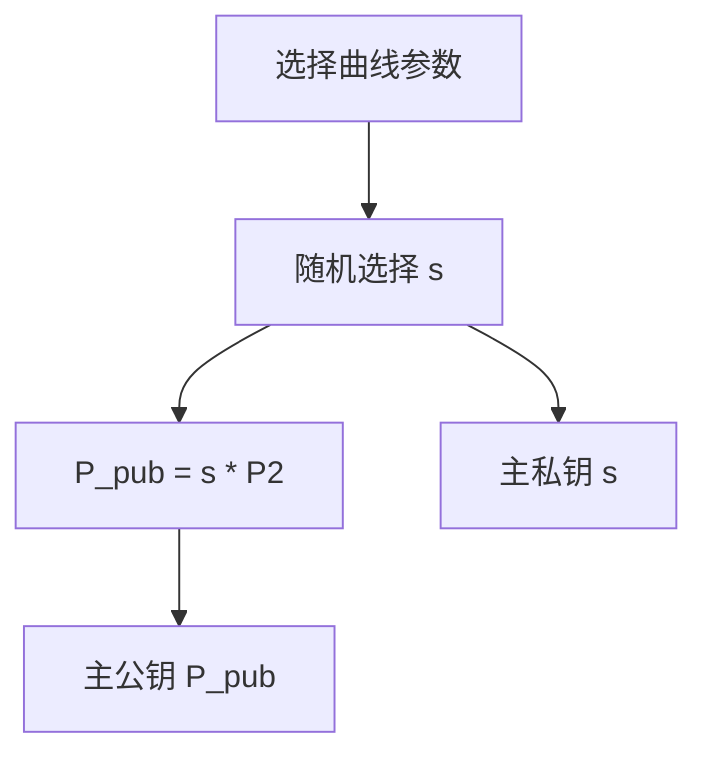
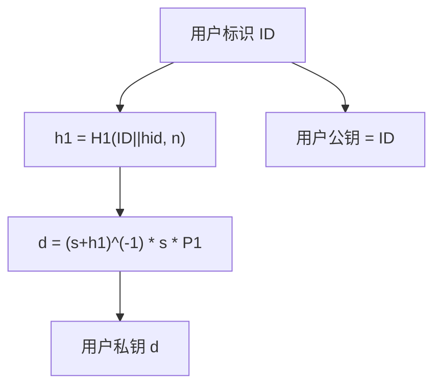
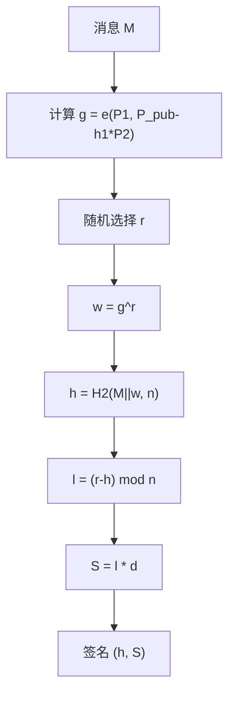
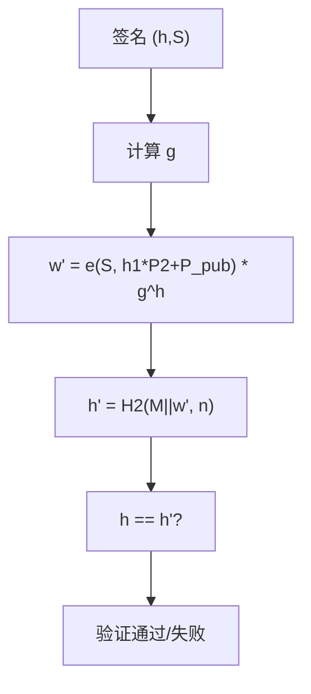
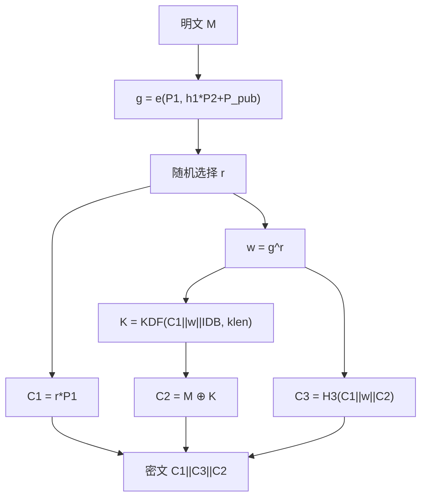
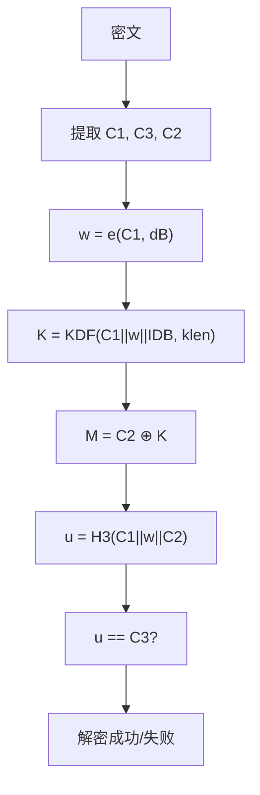
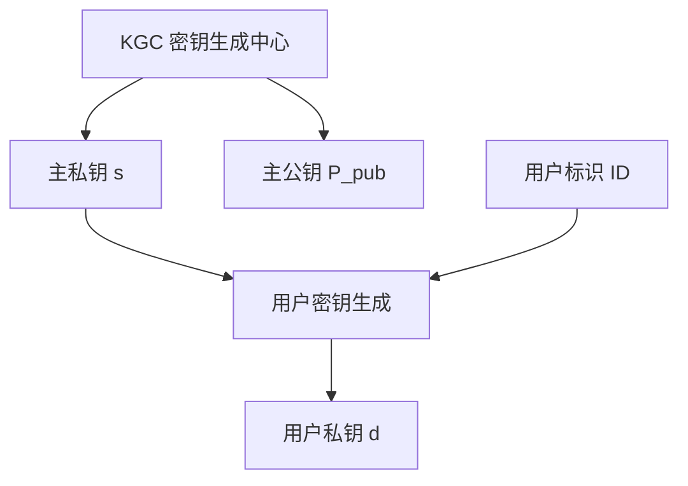
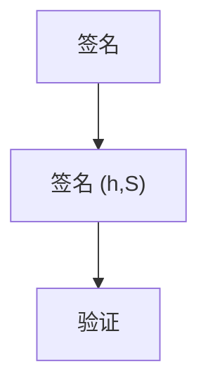
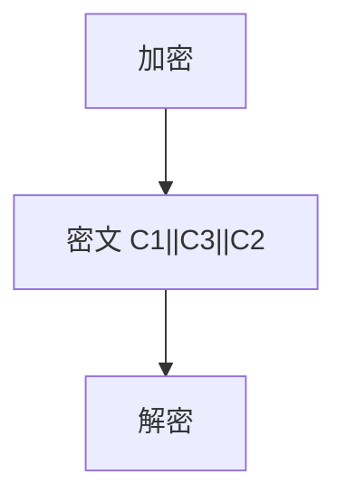

# SM9 算法详解

## 文档状态

已补全 SM9 算法核心原理、密钥生成、签名验证、加密解密、C 语言实现框架、以及 OpenSSL/GMSSL 使用示例。

## 目录

1. 算法背景
2. 参数与记号
3. 数学基础
4. SM9 主密钥生成
5. SM9 用户密钥生成
6. SM9 签名流程
7. SM9 验证流程
8. SM9 加密流程
9. SM9 解密流程
10. Mermaid 流程图
11. 数据结构设计
12. C 语言实现框架
13. SM9 曲线参数
14. OpenSSL / GMSSL 使用
15. 测试向量与验证
16. 安全性分析
17. 工程建议
18. 与 SM2/IBE 对比

## 1. 算法背景

SM9 是中国国家密码管理局于 2016 年发布的基于标识的密码算法（Identity-Based Cryptography, IBC），标准号为 GB/T 32918-2016（原 GM/T 0008-2012）。
SM9 使用双线性对（Bilinear Pairing）技术，用户可以直接使用身份标识（如邮箱、手机号）作为公钥，无需证书管理。

SM9 的主要特点：
- 基于标识的密钥管理，无需数字证书
- 支持数字签名、密钥交换和公钥加密
- 简化密钥管理流程
- 适用于物联网、移动支付等场景

## 2. 参数与记号

- 主私钥 `s`：KGC（密钥生成中心）的秘密值。
- 主公钥 `P_pub = s * P2`：KGC 的公开值。
- `P1`：加法群 G1 上的基点。
- `P2`：加法群 G2 上的基点。
- 用户标识 `ID`：用户的身份标识（如邮箱、手机号）。
- 用户私钥 `d`：由 KGC 为用户生成的私钥。
- 双线性对 `e`：`G1 × G2 → GT` 的映射。
- 哈希函数 `H1, H2, H3`：SM9 定义的哈希函数。

## 3. 数学基础

### 3.1 双线性对

SM9 使用双线性对 `e: G1 × G2 → GT`，满足以下性质：

1. **双线性**：`e(aP, bQ) = e(P, Q)^(ab)`
2. **非退化性**：存在 `P ∈ G1, Q ∈ G2` 使得 `e(P, Q) ≠ 1`
3. **可计算性**：存在有效算法计算 `e(P, Q)`

SM9 使用 R-ate 对或 Ate 对实现。

### 3.2 群结构

- `G1`：椭圆曲线上的加法群（阶为素数 N）
- `G2`：椭圆曲线上的加法群（阶为素数 N）
- `GT`：有限域上的乘法群（阶为素数 N）

### 3.3 哈希到群

SM9 定义了将身份标识映射到群元素的哈希函数：

```
H1(ID, n):
    h = SM3(ID || 0x01)
    return (h mod n) + 1
```

### 3.4 KDF 密钥派生函数

SM9 加密使用 KDF 派生密钥：

```
KDF(Z, klen):
    ct = 0x00000001
    for i in 1..ceil(klen/v):
        Ha_i = SM3(Z || ct)
        ct++
    K = Ha_1 || Ha_2 || ...
    return K的前 klen 位
```

## 4. SM9 主密钥生成

主密钥生成步骤：

1. 选择椭圆曲线参数和双线性对参数。
2. 随机选择主私钥 `s`，`1 ≤ s ≤ n-1`。
3. 计算主公钥 `P_pub = s * P2`。

伪码：

```
s = RandomInteger(1, n-1)
P_pub = PointMultiply(s, P2)
MasterPrivateKey = s
MasterPublicKey = P_pub
```

### 4.1 SM9 主密钥生成流程图



## 5. SM9 用户密钥生成

用户密钥生成步骤：

1. 计算用户标识的哈希值 `h1 = H1(ID || hid, n)`。
2. 计算用户私钥 `d = (s + h1)^(-1) * s * P1`（签名私钥）或类似公式（加密私钥）。

伪码：

```
h1 = H1(ID || hid, n)
d = PointMultiply(ModularInverse(s + h1, n) * s, P1)
UserPrivateKey = d
UserPublicKey = ID  // 标识即公钥
```

### 5.1 SM9 用户密钥生成流程图



## 6. SM9 签名流程

签名步骤：

1. 计算群元素 `g = e(P1, P_pub - h1 * P2)`。
2. 随机选择临时密钥 `r`，`1 ≤ r ≤ n-1`。
3. 计算 `w = g^r`。
4. 计算消息哈希 `h = H2(M || w, n)`。
5. 计算 `l = (r - h) mod n`，若 `l = 0` 则重新选择 `r`。
6. 计算签名 `S = l * d`。
7. 签名为 `(h, S)`。

伪码：

```
h1 = H1(ID || hid, n)
g = Pairing(P1, P_pub - h1 * P2)
r = RandomInteger(1, n-1)
w = g^r
h = H2(M || w, n)
l = (r - h) mod n
S = PointMultiply(l, d)
Signature = (h, S)
```

### 6.1 SM9 签名流程图



## 7. SM9 验证流程

验证步骤：

1. 计算群元素 `g = e(P1, P_pub - h1 * P2)`。
2. 计算 `w' = e(S, h1 * P2 + P_pub) * g^h`。
3. 计算 `h' = H2(M || w', n)`。
4. 验证 `h == h'`。

伪码：

```
h1 = H1(ID || hid, n)
g = Pairing(P1, P_pub - h1 * P2)
w_prime = Pairing(S, h1 * P2 + P_pub) * g^h
h_prime = H2(M || w_prime, n)
return h == h_prime
```

### 7.1 SM9 验证流程图



## 8. SM9 加密流程

SM9 加密步骤：

1. 计算群元素 `g = e(P1, h1 * P2 + P_pub)`。
2. 随机选择临时密钥 `r`，`1 ≤ r ≤ n-1`。
3. 计算 `w = g^r`。
4. 计算 `K = KDF(C1 || w || IDB, klen)`。
5. 计算 `C1 = r * P1`。
6. 计算 `C2 = M ⊕ K`。
7. 计算 `C3 = H3(C1 || w || C2)`。
8. 密文为 `C1 || C3 || C2`。

伪码：

```
h1 = H1(IDB || hid, n)
g = Pairing(P1, h1 * P2 + P_pub)
r = RandomInteger(1, n-1)
C1 = PointMultiply(r, P1)
w = g^r
K = KDF(C1 || w || IDB, bitlen(M))
C2 = M XOR K
C3 = H3(C1 || w || C2)
Ciphertext = C1 || C3 || C2
```

### 8.1 SM9 加密流程图



## 9. SM9 解密流程

SM9 解密步骤：

1. 从密文中提取 `C1`、`C3`、`C2`。
2. 验证 `C1` 是否为群 G1 上的有效点。
3. 计算 `w = e(C1, dB)`。
4. 计算 `K = KDF(C1 || w || IDB, klen)`。
5. 计算 `M = C2 ⊕ K`。
6. 计算 `u = H3(C1 || w || C2)`。
7. 验证 `u == C3`，若不等则解密失败。

伪码：

```
w = Pairing(C1, dB)
K = KDF(C1 || w || IDB, bitlen(C2))
M = C2 XOR K
u = H3(C1 || w || C2)
if u != C3:
    return ERROR
return M
```

### 9.1 SM9 解密流程图



## 10. Mermaid 流程图

### 10.1 SM9 密钥管理



### 10.2 SM9 签名与验证



### 10.3 SM9 加密与解密



## 11. 数据结构设计

推荐数据结构：

- `u32 masterPrivateKey[8]`：256-bit 主私钥。
- `u32 masterPublicKeyX[8]`：主公钥 X 坐标。
- `u32 masterPublicKeyY[8]`：主公钥 Y 坐标。
- `u32 userPrivateKeyX[8]`：用户私钥 X 坐标。
- `u32 userPrivateKeyY[8]`：用户私钥 Y 坐标。

接口设计示例：

- `void SM9_GenerateMasterKey(SM9_Context_S* context);`
- `void SM9_ExtractUserKey(const char* id, SM9_UserKey_S* userKey, const SM9_Context_S* context);`
- `void SM9_Sign(const u8* message, size_t msgLen, SM9_Signature_S* sig, const SM9_UserKey_S* userKey, const SM9_Context_S* context);`
- `int SM9_Verify(const u8* message, size_t msgLen, const SM9_Signature_S* sig, const char* id, const SM9_Context_S* context);`
- `void SM9_Encrypt(const u8* plaintext, size_t ptLen, u8* ciphertext, size_t* ctLen, const char* id, const SM9_Context_S* context);`
- `int SM9_Decrypt(const u8* ciphertext, size_t ctLen, u8* plaintext, size_t* ptLen, const SM9_UserKey_S* userKey, const SM9_Context_S* context);`

## 12. C 语言实现框架

示例实现包含 SM9 核心运算（简化版，使用模拟双线性对）。

```c
#include <stdint.h>
#include <string.h>

typedef uint8_t u8;
typedef uint32_t u32;

#define SM9_WORD_SIZE 8

typedef struct {
    u32 masterPrivateKey[SM9_WORD_SIZE];
    u32 masterPublicKeyX[SM9_WORD_SIZE];
    u32 masterPublicKeyY[SM9_WORD_SIZE];
} SM9_Context_S;

typedef struct {
    u32 privateKeyX[SM9_WORD_SIZE];
    u32 privateKeyY[SM9_WORD_SIZE];
} SM9_UserKey_S;

typedef struct {
    u32 h[SM9_WORD_SIZE];
    u32 pointX[SM9_WORD_SIZE];
    u32 pointY[SM9_WORD_SIZE];
} SM9_Signature_S;

void SM9_GenerateMasterKey(SM9_Context_S* context)
{
    (void)context;
}

void SM9_ExtractUserKey(const char* id, SM9_UserKey_S* userKey, const SM9_Context_S* context)
{
    (void)id;
    (void)userKey;
    (void)context;
}

void SM9_Sign(const u8* message, size_t msgLen, SM9_Signature_S* sig, const SM9_UserKey_S* userKey, const SM9_Context_S* context)
{
    (void)message;
    (void)msgLen;
    (void)sig;
    (void)userKey;
    (void)context;
}

int SM9_Verify(const u8* message, size_t msgLen, const SM9_Signature_S* sig, const char* id, const SM9_Context_S* context)
{
    (void)message;
    (void)msgLen;
    (void)sig;
    (void)id;
    (void)context;
    return 0;
}

void SM9_Encrypt(const u8* plaintext, size_t ptLen, u8* ciphertext, size_t* ctLen, const char* id, const SM9_Context_S* context)
{
    (void)plaintext;
    (void)ptLen;
    (void)ciphertext;
    (void)ctLen;
    (void)id;
    (void)context;
}

int SM9_Decrypt(const u8* ciphertext, size_t ctLen, u8* plaintext, size_t* ptLen, const SM9_UserKey_S* userKey, const SM9_Context_S* context)
{
    (void)ciphertext;
    (void)ctLen;
    (void)plaintext;
    (void)ptLen;
    (void)userKey;
    (void)context;
    return 0;
}
```

以上为 SM9 算法框架实现。完整实现需要双线性对运算库支持，生产环境推荐使用 GMSSL 等成熟库。

## 13. SM9 曲线参数

### 13.1 推荐 256-bit 曲线

SM9 使用与 SM2 不同的曲线参数：

- 素数 `p`：256-bit 素数
- 嵌入度 `k`：通常为 12
- 群 `G1`：Fp 上的椭圆曲线群
- 群 `G2`：Fp^k 上的椭圆曲线群
- 群 `GT`：Fp^k^* 的子群

### 13.2 双线性对参数

- 对类型：R-ate 对或 Ate 对
- 群阶 `N`：256-bit 素数
- 嵌入度 `k = 12`

## 14. OpenSSL / GMSSL 使用

### GMSSL SM9 主密钥生成

```bash
gmssl sm9 -genmaster -out sm9_master.pem
gmssl sm9 -in sm9_master.pem -pubout -out sm9_master_pub.pem
```

### GMSSL SM9 用户密钥提取

```bash
gmssl sm9 -extract -id alice@example.com -in sm9_master.pem -out sm9_alice_private.pem
```

### GMSSL SM9 签名

```bash
gmssl sm9 -sign -in sm9_alice_private.pem -in message.txt -out signature.bin
```

### GMSSL SM9 验证

```bash
gmssl sm9 -verify -id alice@example.com -in sm9_master_pub.pem -in message.txt -signature signature.bin
```

### GMSSL SM9 加密

```bash
gmssl sm9 -encrypt -id bob@example.com -in sm9_master_pub.pem -in plain.txt -out cipher.bin
```

### GMSSL SM9 解密

```bash
gmssl sm9 -decrypt -in sm9_bob_private.pem -in cipher.bin -out plain_out.txt
```

## 15. 测试向量与验证

### SM9 签名测试向量

GB/T 32918-2016 中的测试向量：

- 用户 ID：`31323334353637383132333435363738`（"1234567812345678"）
- 主私钥 `s` 和消息 `M` 为已知值
- 签名 `(h, S)` 为预期输出

### SM9 加密测试向量

- 接收者 ID：`31323334353637383132333435363738`
- 明文：`6D65737361676520646967657374`（"message digest"）
- 密文包含 `C1 || C3 || C2` 三部分

### 验证方式

1. 生成 SM9 主密钥对。
2. 提取用户私钥。
3. 使用用户私钥签名，使用标识验证。
4. 使用标识加密，使用用户私钥解密。
5. 验证加解密一致性。

## 16. 安全性分析

SM9 的安全性基于双线性对相关困难问题的困难性。

- 256-bit SM9 提供约 128-bit 安全级别。
- 双线性对的安全性基于 BDH（Bilinear Diffie-Hellman）问题。
- KGC 是信任锚点，KGC 的主私钥泄露将危及所有用户。
- 临时密钥 `r` 必须使用密码学安全随机数生成器。

### 16.1 安全优势

- 基于标识的密钥管理简化了证书管理。
- 无需 PKI 基础设施。
- 天然支持属性基加密扩展。

### 16.2 安全风险

- KGC 密钥托管问题：KGC 可以解密所有用户的消息。
- KGC 主私钥泄露影响所有用户。
- 双线性对运算较慢，可能成为性能瓶颈。
- 密钥撤销需要额外机制。

## 17. 工程建议

- 生产环境首选成熟库实现，如 GMSSL。
- KGC 主私钥必须严格保护，推荐使用 HSM。
- 实现密钥撤销机制（如 CRL 或短期密钥）。
- 双线性对运算是性能瓶颈，需优化实现。
- 考虑 KGC 密钥托管问题，在需要不可否认性时使用双密钥方案。
- 加密时必须验证 C1 为有效曲线点。
- 解密时必须验证 C3 校验值。

## 18. 与 SM2/IBE 对比

| 特性 | SM9 | SM2 | 传统 IBE (BF-IBE) |
|------|-----|-----|-------------------|
| 算法类型 | 标识密码 | 椭圆曲线 | 标识密码 |
| 密钥管理 | 无需证书 | 需要证书 | 无需证书 |
| 双线性对 | 需要 | 不需要 | 需要 |
| 签名速度 | 较慢 | 快 | 较慢 |
| 加密支持 | 是 | 是 | 是 |
| 标准化 | GB/T 32918 | GB/T 32918 | 无国际标准 |
| 密钥托管 | 是 | 否 | 是 |

SM9 相比 SM2 简化了密钥管理，但性能较低且存在密钥托管问题。
SM9 相比传统 BF-IBE 方案，标准化程度更高，安全性分析更充分。
